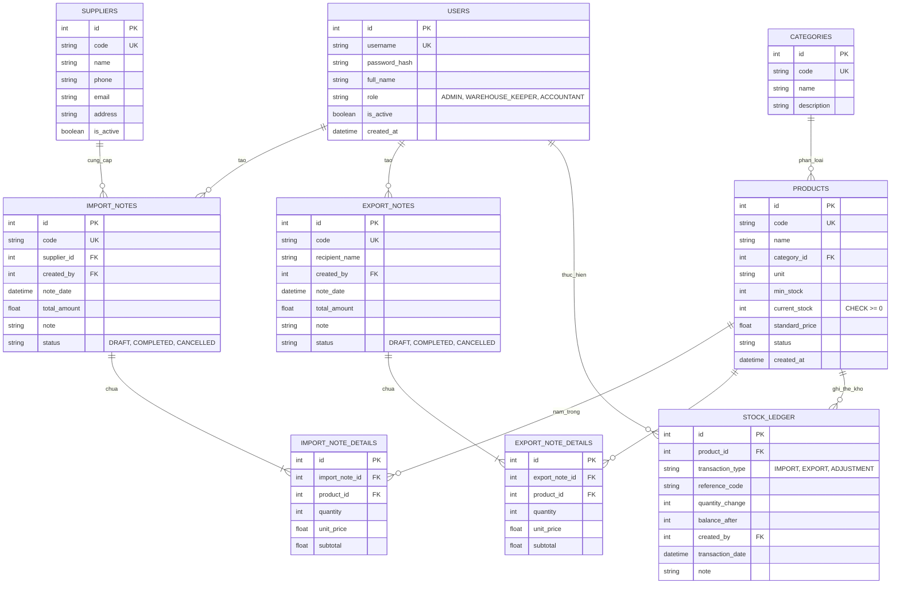

# Hệ thống quản lý kho có tích hợp AI — Đặc tả hợp nhất (Đề tài 07)

## 1. Vai trò & bối cảnh cho AI thực thi

```text
Bạn là kỹ sư phần mềm full-stack senior, đóng vai trò dẫn dắt một sinh viên
CNTT (năm cuối, đang học song song môn Triển khai phần mềm & Ứng dụng AI)
xây dựng đồ án môn học "Hệ thống quản lý kho có tích hợp AI" (Đề tài 07).

Ràng buộc làm việc:
- Sinh viên sẽ tự nộp báo cáo và thuyết trình — code phải có comment rõ ràng,
  cấu trúc sạch để sinh viên GIẢI THÍCH ĐƯỢC trước hội đồng, không dùng "hộp đen".
- Ưu tiên MVP chạy đúng nghiệp vụ kho trước, tối ưu sau.
- Đảm bảo tính nhất quán tuyệt đối của số liệu kho: dùng Database Transaction,
  chặn 100% nguy cơ tồn kho âm và có Thẻ kho (Stock Ledger) để truy vết.
- Mọi lần AI sinh code hoặc thiết kế, sinh viên cần lưu lại prompt +
  tóm tắt phản hồi vào nhật ký AI (docs/SDLC/) — vì đây là minh chứng bắt buộc chấm điểm.
- Bám sát rubric đánh giá 4 giai đoạn SDLC: KT1 -> KT2 -> KT3 -> Cuối kỳ.
- Không tự ý mở rộng phạm vi (feature creep) gây quá tải cho đồ án.
```

---

## 2. Tổng quan bài toán

Doanh nghiệp nhỏ cần quản lý hàng hóa, nhà cung cấp, nhập kho, xuất kho, tồn kho và cảnh báo hàng sắp hết. Quản lý bằng bảng tính dễ sai lệch số lượng, khó truy vết giao dịch và chậm phát hiện bất thường.

Đề tài yêu cầu xây dựng hệ thống quản lý kho hoàn chỉnh có tích hợp AI để:

1. Sinh báo cáo nhập-xuất-tồn định kỳ theo tháng.
2. Gợi ý nhập hàng tối ưu dựa trên tồn kho, tồn tối thiểu và tốc độ xuất.
3. Tóm tắt các biến động bất thường (xuất tăng đột biến hoặc hàng tồn kho lâu ngày).

**Nguyên tắc thiết kế cốt lõi**:

- AI là lớp hỗ trợ ra quyết định thông minh, không can thiệp trực tiếp làm thay đổi số liệu kho.
- Nếu AI service mất kết nối/hết quota, hệ thống quản lý kho vẫn hoạt động bình thường nhờ cơ chế Fallback Heuristic.
- Đảm bảo an toàn dữ liệu: không gửi giá mua/giá nhập nhạy cảm vào prompt AI.

---

## 3. Yêu cầu chức năng chi tiết

### 3.1. Actor & phân quyền (RBAC)

Hệ thống phân quyền chuẩn xác theo đúng yêu cầu `de_tai_07.md` gồm 3 vai trò:

| Actor | Quyền hạn chính |
| --- | --- |
| **Quản trị viên (Admin)** | Toàn quyền quản trị: Quản lý tài khoản người dùng, phân quyền, cấu hình hệ thống, cấu hình ngưỡng cảnh báo tồn kho, xem toàn bộ báo cáo tổng hợp và cấu hình AI API key. |
| **Thủ kho (Warehouse Keeper)** | Nghiệp vụ kho thực tế: Lập và quản lý phiếu nhập kho, phiếu xuất kho, theo dõi tồn kho tức thời, xem cảnh báo hàng dưới tồn tối thiểu, tra cứu thẻ kho, xem gợi ý nhập hàng và tóm tắt bất thường từ AI. |
| **Kế toán (Accountant)** | Nghiệp vụ đối soát & báo cáo: Xem và đối soát lịch sử nhập xuất theo chứng từ/nhà cung cấp, xem báo cáo tổng hợp Nhập - Xuất - Tồn theo kỳ, theo dõi giá trị tồn kho/doanh số xuất, xuất báo cáo đối chiếu. (Không trực tiếp thao tác xuất nhập kho vật lý). |

---

### 3.2. Quản lý Danh mục, Hàng hóa & Nhà cung cấp

1. **Nhóm hàng (Categories)**: CRUD mã nhóm, tên nhóm hàng, mô tả.
2. **Hàng hóa (Products)**:
   - Các trường: `code` (Mã SKU), `name` (Tên hàng), `category_id` (Nhóm hàng), `unit` (Đơn vị tính: Cái, Hộp, Thùng, Kg...), `min_stock` (Ngưỡng tồn tối thiểu để cảnh báo), `current_stock` (Số lượng tồn tức thời), `standard_price` (Giá niêm yết/tham khảo), `status` (Đang kinh doanh / Ngừng kinh doanh).
   - **Ràng buộc an toàn**: `current_stock >= 0` (Database Check Constraint).
   - **Không lưu giá nhập tĩnh trên hàng hóa**: Giá nhập được lưu theo từng lần nhập thực tế trong chi tiết phiếu nhập để làm cơ sở tính giá vốn chính xác.
3. **Nhà cung cấp (Suppliers)**: CRUD mã NCC, tên NCC, người liên hệ, số điện thoại, email, địa chỉ, trạng thái hợp tác.

---

### 3.3. Phiếu nhập kho, Phiếu xuất kho & Cập nhật tồn kho

1. **Lập Phiếu nhập kho (Import Notes)**:
   - Chọn nhà cung cấp, ngày nhập, ghi chú, danh sách mặt hàng kèm số lượng nhập và đơn giá nhập.
   - **Transaction ACID**: Lưu phiếu nhập + Lưu chi tiết phiếu nhập + **Tăng `current_stock`** của sản phẩm + **Ghi nhận vào Thẻ kho (`stock_ledger`)**.
2. **Lập Phiếu xuất kho (Export Notes)**:
   - Chọn người nhận/khách hàng, ngày xuất, ghi chú, danh sách mặt hàng kèm số lượng xuất và đơn giá xuất.
   - **Kiểm tra tồn kho nghiêm ngặt (Atomic Update)**:
     - Câu lệnh kiểm tra và trừ tồn thực thi đồng thời: `current_stock >= requested_quantity`.
     - Nếu không đủ hàng: **Rollback ngay lập tức**, trả về lỗi HTTP 400 kèm thông báo rõ ràng cho thủ kho, **tuyệt đối không cho tồn kho âm**.
     - Nếu đủ hàng: Giảm `current_stock` + Lưu chi tiết + **Ghi nhận vào Thẻ kho (`stock_ledger`)**.
3. **Trạng thái phiếu (State Machine)**:
   - `DRAFT`: Phiếu nháp, cho phép chỉnh sửa, chưa tác động vào tồn kho.
   - `COMPLETED`: Đã ghi sổ, cập nhật tồn kho, khóa không cho sửa/xóa trực tiếp để bảo vệ tính nhất quán dữ liệu.
   - `CANCELLED`: Phiếu bị hủy, tự động tạo giao dịch hoàn trả số lượng tương ứng vào kho.

---

### 3.4. Tra cứu lịch sử, Thẻ kho & Cảnh báo tồn

1. **Tra cứu lịch sử nhập xuất**: Lọc đa tiêu chí theo mã hàng hóa, nhóm hàng, khoảng thời gian (từ ngày... đến ngày...), và nhà cung cấp.
2. **Thẻ kho / Sổ kho (`stock_ledger`)**:
   - Ghi lại chi tiết từng biến động số lượng: Mã hàng, loại giao dịch (NHẬP / XUẤT / ĐIỀU CHỈNH), mã phiếu tham chiếu, số lượng thay đổi (+/-), số dư tồn sau giao dịch, người thực hiện, thời gian thực tế.
3. **Cảnh báo hàng dưới tồn tối thiểu**:
   - Tự động phát hiện các mặt hàng có `current_stock <= min_stock`.
   - Hiển thị trực quan qua badge cảnh báo đỏ/vàng trên Dashboard và danh sách hàng hóa.
4. **Thống kê Nhập - Xuất - Tồn theo kỳ**:
   - Tính toán chính xác: `Tồn đầu kỳ + Nhập trong kỳ - Xuất trong kỳ = Tồn cuối kỳ`.

---

### 3.5. Chức năng AI (3 năng lực theo Đề tài 07)

1. **AI sinh báo cáo Nhập - Xuất - Tồn theo tháng**:
   - Tổng hợp số liệu kho trong tháng, nhận xét tình trạng luân chuyển hàng hóa, đánh giá hiệu quả lưu kho.
2. **AI gợi ý nhập hàng**:
   - Tính toán dựa trên: `current_stock`, `min_stock`, và **tốc độ xuất trung bình (velocity)** trong 30 ngày gần nhất.
   - Đề xuất số lượng nhập khuyến nghị kèm lý do cụ thể và mức độ ưu tiên (Khẩn cấp / Bình thường).
3. **AI tóm tắt biến động bất thường**:
   - **Xuất tăng đột biến**: Phát hiện mặt hàng có lượng xuất tăng vọt bất thường (> 200% so với trung bình).
   - **Hàng tồn lâu/chết (Dead stock)**: Phát hiện mặt hàng còn tồn kho nhưng không có giao dịch xuất trong > 30 hoặc 60 ngày.

**Prompt mẫu chuẩn (Anti-hallucination & Bảo mật)**:

```text
System: Bạn là trợ lý quản lý kho chuyên nghiệp. Bạn CHỈ phân tích dựa trên số liệu được cung cấp trong bảng tổng hợp. Tuyệt đối KHÔNG tự tạo hoặc bịa đặt số liệu mới. Trả về kết quả dưới định dạng Markdown có cấu trúc rõ ràng.

User: Dữ liệu nhập xuất tồn và biến động kho tháng này:
{{inventory_report}}

Hãy sinh báo cáo ngắn gọn gồm:
1. Tình trạng tồn kho tổng quan.
2. Danh sách mặt hàng cần nhập thêm (kèm số lượng đề xuất và mức độ ưu tiên).
3. Các điểm bất thường đáng chú ý (hàng xuất tăng đột biến hoặc hàng tồn lâu không xuất).
```

---

## 4. Yêu cầu kỹ thuật & Phi chức năng

| Tiêu chí | Đặc tả kỹ thuật |
| --- | --- |
| **Backend** | **Python 3.14 + FastAPI**: Tốc độ xử lý cao, async, tự động sinh Swagger UI (`/docs`), Pydantic v2 validation. |
| **Frontend** | **React 18 + Vite + Tailwind CSS + Lucide Icons**: Giao diện Dashboard SPA hiện đại, mượt mà, phản hồi tức thời. |
| **CSDL** | **SQLite** (phát triển & demo nhanh không cần cài server) + **SQLAlchemy 2.0 ORM** (sẵn sàng chuyển PostgreSQL). |
| **AI Engine** | **Google Gemini API** (`gemini-1.5-flash` / `gemini-2.5-flash`) + **Heuristic Fallback Engine** (tự động chạy offline khi mất mạng/hết API key). |
| **Bảo mật** | Hash mật khẩu bằng `bcrypt`, xác thực qua `JWT Bearer Token`, CORS middleware an toàn, bóc tách giá mua nhạy cảm khỏi context AI. |
| **Toàn vẹn kho** | Database Transaction ACID, Atomic Update, ràng buộc `CHECK (current_stock >= 0)`. |
| **Kiểm thử** | Bộ test tự động **Pytest** tại `backend/tests/` bao quát: Nhập hàng, Xuất hàng, Chặn tồn âm, và Báo cáo AI. |

---

## 5. Thiết kế Cơ sở Dữ liệu (ERD)

### 5.1. Danh sách 9 Model cốt lõi

1. `users`: Tài khoản, mật khẩu bcrypt, vai trò (`ADMIN`, `WAREHOUSE_KEEPER`, `ACCOUNTANT`).
2. `categories`: Nhóm ngành hàng (`code`, `name`, `description`).
3. `products`: Hàng hóa (`code`, `name`, `category_id`, `unit`, `min_stock`, `current_stock`, `standard_price`, `status`).
4. `suppliers`: Nhà cung cấp (`code`, `name`, `phone`, `email`, `address`, `is_active`).
5. `import_notes`: Phiếu nhập kho (`code`, `supplier_id`, `created_by`, `note_date`, `total_amount`, `status`).
6. `import_note_details`: Dòng hàng nhập (`import_note_id`, `product_id`, `quantity`, `unit_price`, `subtotal`).
7. `export_notes`: Phiếu xuất kho (`code`, `recipient_name`, `created_by`, `note_date`, `total_amount`, `status`).
8. `export_note_details`: Dòng hàng xuất (`export_note_id`, `product_id`, `quantity`, `unit_price`, `subtotal`).
9. `stock_ledger`: Thẻ kho / Sổ kiểm toán (`product_id`, `transaction_type`, `reference_code`, `quantity_change`, `balance_after`, `created_by`, `transaction_date`, `note`).

### 5.2. Sơ đồ quan hệ thực thể (Mermaid ERD)



---

## 6. Cấu trúc Thư mục Dự án chuẩn Monorepo

```text
E:\hệ thống quản lý kho\
├── docs/
│   ├── implementation_plan.md                     # Phân tích chuyên sâu & lộ trình P0/P1/P2
│   └── SDLC/                                      # Tài liệu chấm điểm 4 giai đoạn
│       ├── KT1/                                   # 01_SRS_and_UseCases, 02_ERD, 03_AI_Arch, 04_Wireframes
│       ├── KT2/                                   # 01_APIs, 02_Transactions, 03_AI_Coding_Evidence
│       ├── KT3/                                   # 01_Prompts, 02_Test_Results, 03_AI_Fallback
│       └── final/                                 # 01_Final_Report, 02_User_Guide, 03_Slides
├── backend/
│   ├── app/
│   │   ├── api/v1/endpoints/                      # auth, products, suppliers, imports, exports, reports, ai
│   │   ├── core/                                  # config.py, database.py, security.py
│   │   ├── models/                                # user, product, supplier, import_note, export_note, stock_ledger
│   │   ├── schemas/                               # pydantic validation schemas
│   │   ├── services/                              # inventory_service (ACID), ai_service (Gemini + Fallback)
│   │   └── main.py                                # FastAPI app entry point
│   ├── tests/                                     # test_stock, test_transactions, test_ai
│   ├── seed_data.py                               # Script nạp 20+ SP, 3 tài khoản, dữ liệu 60 ngày
│   ├── requirements.txt
│   └── .env.example
├── frontend/
│   ├── src/
│   │   ├── components/                            # Navbar, Sidebar, Modal, Badge, Table
│   │   ├── pages/                                 # Dashboard, Products, Suppliers, Imports, Exports, Reports, AIAssistant
│   │   ├── services/                              # Axios api client
│   │   ├── context/                               # AuthContext
│   │   ├── App.jsx
│   │   └── main.jsx
│   ├── package.json
│   ├── vite.config.js
│   └── tailwind.config.js
├── de_tai_07.md                                   # Đề bài gốc của giảng viên
└── Prompt.md                                      # Tài liệu đặc tả hợp nhất này
```

---

## 7. Kịch bản AI chi tiết & Prompt Optimization

### 7.1. Pipeline tổng hợp dữ liệu (Data Pre-processing)

Trước khi gọi AI, Backend truy vấn SQL tổng hợp các chỉ số sau (tránh gửi dữ liệu thô vượt token):

- Tồn đầu, tổng nhập, tổng xuất, tồn cuối của từng mặt hàng trong kỳ.
- Vận tốc xuất (số lượng xuất bình quân ngày trong 30 ngày qua).
- Danh sách mặt hàng `current_stock <= min_stock`.
- Danh sách mặt hàng không phát sinh xuất kho $> 30$ ngày.
- Danh sách mặt hàng có lượng xuất tuần này tăng $> 200\%$ so với tuần trước.
- **Loại bỏ hoàn toàn thông tin giá mua nhập hàng**.

### 7.2. Fallback Heuristic Engine (Offline Safe)

Nếu `GEMINI_API_KEY` trống hoặc kết nối API AI bị timeout/lỗi:

- Hệ thống tự động kích hoạt thuật toán Heuristic:
  - Tự động lọc ra top sản phẩm dưới `min_stock` và tính số lượng nhập khuyến nghị: `suggested_qty = (min_stock * 2) - current_stock`.
  - Tự động gắn nhãn mặt hàng xuất tăng vọt hoặc hàng ứ đọng.
  - Trả về cấu trúc JSON/Markdown y hệt phản hồi từ AI, đảm bảo giao diện web không bị gián đoạn và luôn demo được.

---

## 8. Lộ trình triển khai theo SDLC (Khớp 4 mốc chấm điểm)

| Giai đoạn | Nhiệm vụ chính | Sản phẩm nộp |
| --- | --- | --- |
| **KT1** | Phân tích bài toán, Actor, Use Case, thiết kế ERD, ràng buộc chống tồn âm, kiến trúc AI và wireframe giao diện. | Bộ tài liệu trong `docs/SDLC/KT1/`, sơ đồ ERD trực quan. |
| **KT2** | Dựng Backend FastAPI, Auth & RBAC (3 vai trò), CRUD Danh mục/Hàng hóa/NCC, Transaction Nhập/Xuất kho, Thẻ kho, kiểm tra tồn âm, Seed Data 60 ngày. | Source code backend chạy ổn định, Swagger docs, tài liệu `docs/SDLC/KT2/`. |
| **KT3** | Tích hợp AI Gemini API + Fallback Engine, tối ưu Prompt chống ảo giác, viết bộ kiểm thử Pytest (nhập, xuất, tồn âm, AI), ghi nhật ký sử dụng AI. | Module AI hoàn chỉnh, test suite pass 100%, tài liệu `docs/SDLC/KT3/`. |
| **Cuối kỳ** | Hoàn thiện Frontend React + Tailwind, Dashboard biểu đồ, kiểm tra bảo mật, tài liệu README 1-click, slide và kịch bản demo bảo vệ đồ án. | Ứng dụng Full-stack hoàn chỉnh, slide, báo cáo tổng kết tại `docs/SDLC/final/`. |

---

## 9. Yêu cầu định dạng thực thi khi AI hỗ trợ

1. **Xác nhận phạm vi**: Bám sát 100% đặc tả trong tài liệu này và `de_tai_07.md`.
2. **Comment code rõ ràng**: Mọi logic phức tạp (đặc biệt là Transaction cập nhật tồn kho và tính toán số liệu AI) đều phải có chú thích tiếng Việt dễ hiểu.
3. **Tách biệt Prompt**: Toàn bộ prompt được quản lý tập trung trong file hoặc module riêng biệt, không hardcode bừa bãi trong logic API.
4. **Kiểm thử trước khi bàn giao**: Mọi API và chức năng nghiệp vụ đều phải được xác minh tính đúng đắn trước khi kết thúc tác vụ.
