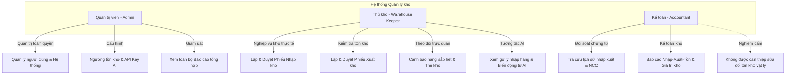
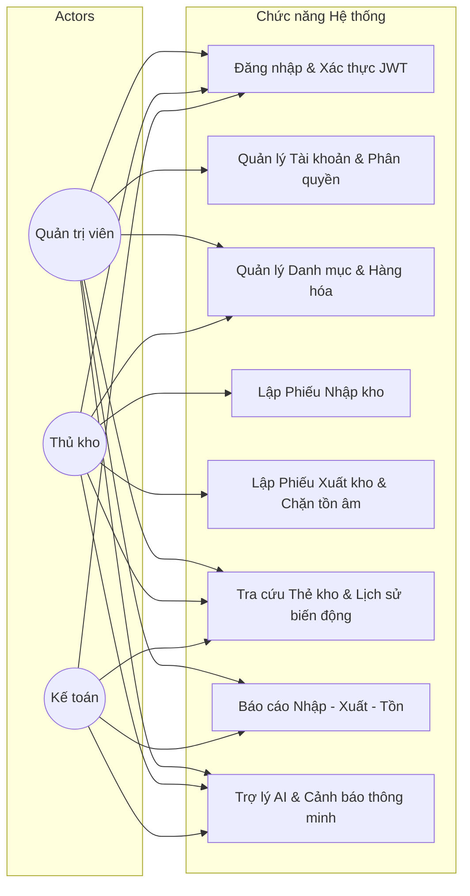
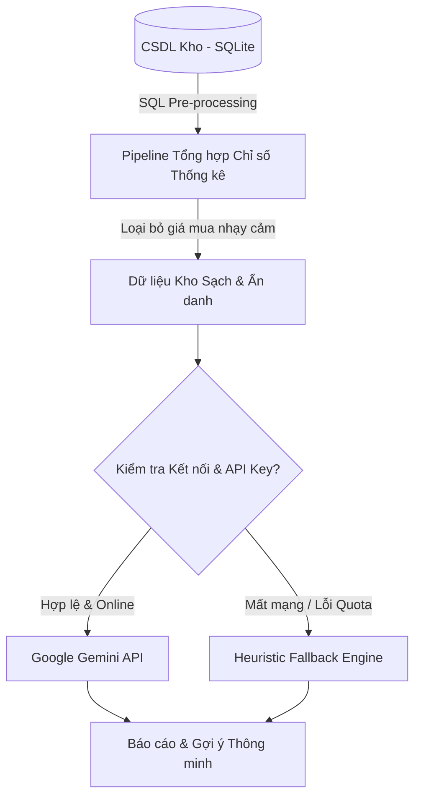

# BÁO CÁO ĐẶC TẢ YÊU CẦU & SƠ ĐỒ USE CASE (SRS & USE CASES)

## Đề tài 07: Hệ thống quản lý kho có tích hợp AI

**Mốc đánh giá:** KT1 — Phân tích yêu cầu & Thiết kế hệ thống  
**Học phần:** Triển khai phần mềm & Ứng dụng AI  
**Ngày hoàn thành:** 2026-09-21  

---

## 1. Bối cảnh & Mục tiêu đề tài

### 1.1. Bối cảnh bài toán thực tế

Tại các doanh nghiệp vừa và nhỏ (SMEs) hoặc hộ kinh doanh thương mại, hoạt động quản trị kho bãi đóng vai trò sống còn trong chuỗi cung ứng. Tuy nhiên, phần lớn các đơn vị này vẫn quản lý kho bằng sổ sách truyền thống hoặc các file bảng tính (Excel/Google Sheets) phân tán. Phương thức này gây ra hàng loạt bất cập:

- **Sai lệch số lượng tồn kho:** Dễ nhập nhầm, khó kiểm soát việc xuất quá số lượng thực tế dẫn đến "tồn kho âm" trên sổ sách.
- **Thiếu tính toàn vẹn và khả năng truy vết:** Không có sổ thẻ kho tức thời để đối chiếu từng giây khi có thất thoát, sai lệch hàng hóa.
- **Chậm trễ trong dự báo & cảnh báo:** Không kịp thời phát hiện các mặt hàng sắp hết để nhập bổ sung, hoặc không nhận diện được hàng tồn đọng lâu ngày gây ứ đọng vốn.
- **Quá tải báo cáo:** Việc tổng hợp số liệu Nhập - Xuất - Tồn hàng tháng tốn nhiều nhân lực và thường xuyên xảy ra sai sót khi đối soát giữa thủ kho và kế toán.

### 1.2. Mục tiêu hệ thống

Hệ thống quản lý kho tích hợp AI (Đề tài 07) được xây dựng nhằm giải quyết triệt để các vấn đề trên với các mục tiêu cốt lõi:

1. **Quản lý dữ liệu tập trung & minh bạch:** Chuẩn hóa quản lý danh mục hàng hóa, nhà cung cấp và lịch sử giao dịch.
2. **Đảm bảo tính toàn vẹn 100% bằng Database Transaction (ACID):** Chặn đứng hoàn toàn nguy cơ tồn kho âm ở cả cấp độ mã nguồn lẫn ràng buộc cơ sở dữ liệu (`CHECK (current_stock >= 0)`). Tự động ghi chép Thẻ kho (`stock_ledger`) cho từng biến động số lượng.
3. **Phân quyền người dùng chặt chẽ (RBAC):** Định rõ trách nhiệm giữa Quản trị viên, Thủ kho và Kế toán.
4. **Trợ lý AI hỗ trợ ra quyết định:** Ứng dụng mô hình ngôn ngữ lớn (Google Gemini) để:
   - Tự động sinh báo cáo tổng kết Nhập - Xuất - Tồn theo tháng.
   - Gợi ý số lượng đặt hàng tối ưu dựa trên ngưỡng an toàn và tốc độ bán/xuất.
   - Tóm tắt biến động bất thường (xuất đột biến >200% hoặc tồn ứ đọng >30 ngày).
5. **Cơ chế dự phòng an toàn (Heuristic Fallback):** Khi mất kết nối Internet hoặc hết hạn mức API, hệ thống tự động chuyển sang cơ chế phân tích bằng thuật toán quy tắc nội bộ, bảo đảm hệ thống luôn vận hành liên tục.

---

## 2. Phân tích Actor & Ma trận phân quyền (RBAC)

Hệ thống thiết lập 3 nhóm vai trò người dùng (Actor) với ranh giới quyền hạn rõ ràng:

### 2.1. Chi tiết quyền hạn từng Actor

#### 1. Quản trị viên (`ADMIN`)

- **Quản trị người dùng:** Tạo mới tài khoản, phân vai trò, đặt lại mật khẩu, kích hoạt hoặc khóa tài khoản nhân viên.
- **Cấu hình tham số:** Cài đặt thông tin doanh nghiệp, cấu hình kết nối AI API Key (Gemini), cấu hình ngưỡng cảnh báo tồn kho mặc định.
- **Giám sát toàn diện:** Truy cập mọi màn hình, xem toàn bộ nhật ký hệ thống, danh mục hàng hóa và báo cáo tổng hợp.

#### 2. Thủ kho (`WAREHOUSE_KEEPER`)

- **Quản lý danh mục & nhà cung cấp:** Thêm mới, chỉnh sửa thông tin hàng hóa (mã SKU, tên, đơn vị tính, ngưỡng tồn tối thiểu `min_stock`), nhóm hàng và nhà cung cấp.
- **Lập phiếu nhập kho:** Tạo phiếu nhập từ nhà cung cấp, nhập chi tiết mặt hàng, số lượng và giá nhập. Xác nhận nhập kho để tăng tồn kho và ghi thẻ kho.
- **Lập phiếu xuất kho:** Tạo phiếu xuất kho cho khách hàng/bộ phận. Hệ thống tự động kiểm tra số lượng tồn; nếu không đủ hàng sẽ từ chối xuất kho.
- **Theo dõi kho:** Nhận cảnh báo tức thời các mặt hàng chạm hoặc dưới ngưỡng tồn tối thiểu (`current_stock <= min_stock`). Tra cứu thẻ kho chi tiết theo từng sản phẩm.
- **Ứng dụng AI:** Xem gợi ý số lượng cần nhập thêm từ AI và tóm tắt cảnh báo các mặt hàng có nguy cơ đọng vốn hoặc tăng đột biến.

#### 3. Kế toán (`ACCOUNTANT`)

- **Đối soát chứng từ:** Tra cứu và tìm kiếm chi tiết các phiếu nhập, phiếu xuất theo khoảng thời gian, số chứng từ, đối tác hoặc người lập.
- **Báo cáo tài chính kho:** Xem báo cáo Nhập - Xuất - Tồn theo kỳ kế toán (tháng/quý), theo dõi giá trị hàng tồn kho và doanh số/chi phí xuất kho.
- **Ranh giới an toàn:** Chỉ có quyền đọc (Read-only) đối với số lượng tồn kho; tuyệt đối không có quyền can thiệp làm thay đổi trực tiếp số lượng tồn kho vật lý.

### 2.2. Ma trận phân quyền chi tiết (RBAC Matrix)

| Chức năng / Tài nguyên | Admin | Thủ kho | Kế toán | Ghi chú |
| :--- | :---: | :---: | :---: | :--- |
| Đăng nhập / Đổi mật khẩu | ✅ | ✅ | ✅ | Tất cả người dùng có tài khoản hợp lệ |
| Quản lý tài khoản người dùng | ✅ | ❌ | ❌ | Chỉ Admin được tạo/khóa tài khoản |
| Quản lý Nhóm hàng (Category) | ✅ | ✅ | 👁️ (Chỉ xem) | Admin & Thủ kho quản lý danh mục |
| Quản lý Hàng hóa (Product) | ✅ | ✅ | 👁️ (Chỉ xem) | Admin & Thủ kho quản lý hàng hóa |
| Quản lý Nhà cung cấp (Supplier) | ✅ | ✅ | 👁️ (Chỉ xem) | Admin & Thủ kho quản lý đối tác |
| Lập Phiếu nhập kho (Import Note) | ✅ | ✅ | ❌ | Kế toán chỉ đối soát chứng từ |
| Lập Phiếu xuất kho (Export Note) | ✅ | ✅ | ❌ | Yêu cầu kiểm tra tồn kho nghiêm ngặt |
| Tra cứu Thẻ kho (`stock_ledger`) | ✅ | ✅ | ✅ | Minh bạch số liệu kiểm toán |
| Báo cáo Nhập - Xuất - Tồn | ✅ | ✅ | ✅ | Kế toán đối soát giá trị |
| Sử dụng Trợ lý AI (3 tính năng) | ✅ | ✅ | ✅ | Hỗ trợ phân tích số liệu |
| Cấu hình Hệ thống & AI Key | ✅ | ❌ | ❌ | Bảo vệ an toàn bí mật API Key |

---

## 3. Sơ đồ Use Case Tổng quan & Đặc tả Luồng nghiệp vụ

### 3.1. Sơ đồ Use Case Tổng quan

### 3.2. Đặc tả chi tiết các Luồng nghiệp vụ chính

#### Luồng 1: Lập Phiếu Nhập kho & Ghi nhận Thẻ kho (Transaction ACID)

1. **Tác nhân:** Thủ kho / Admin.
2. **Điều kiện tiên quyết:** Người dùng đã đăng nhập; Danh mục hàng hóa và nhà cung cấp đã tồn tại.
3. **Các bước thực hiện:**
   - Bước 1: Thủ kho chọn Nhà cung cấp, nhập ngày lập phiếu và ghi chú.
   - Bước 2: Thêm từng dòng sản phẩm cần nhập: chọn mặt hàng, nhập số lượng ($>0$) và đơn giá nhập ($\ge 0$).
   - Bước 3: Hệ thống tính tổng tiền phiếu nhập.
   - Bước 4: Thủ kho nhấn "Xác nhận Nhập kho".
   - Bước 5: Hệ thống mở một **Database Transaction**:
     - Tạo bản ghi `import_notes` và các dòng chi tiết `import_note_details`.
     - Cập nhật tăng số lượng tồn `current_stock = current_stock + quantity` của từng sản phẩm.
     - Tạo bản ghi Thẻ kho `stock_ledger` với loại `IMPORT`, ghi nhận số lượng thay đổi dương và số dư tồn tức thời sau khi nhập.
     - Commit Transaction thành công.
4. **Kết quả:** Phiếu nhập chuyển trạng thái `COMPLETED`. Tồn kho tăng chính xác, thẻ kho được ghi nhận.

#### Luồng 2: Lập Phiếu Xuất kho & Kiểm soát Chống tồn kho âm

1. **Tác nhân:** Thủ kho / Admin.
2. **Điều kiện tiên quyết:** Người dùng đã đăng nhập; kho có sẵn hàng hóa.
3. **Các bước thực hiện:**
   - Bước 1: Thủ kho chọn người nhận/khách hàng, ngày xuất, ghi chú.
   - Bước 2: Chọn danh sách hàng hóa và số lượng cần xuất.
   - Bước 3: Hệ thống kiểm tra số lượng tồn thời gian thực:
     - Giao diện hiển thị cảnh báo đỏ nếu số lượng yêu cầu xuất $> current\_stock$.
   - Bước 4: Thủ kho gửi yêu cầu xác nhận xuất kho.
   - Bước 5: Hệ thống thực hiện giao dịch ACID tại Backend:
     - Khóa bản ghi (hoặc kiểm tra đồng thời) điều kiện: `current_stock >= requested_quantity`.
     - **Nếu có bất kỳ mặt hàng nào không đủ tồn kho:** Hủy bỏ toàn bộ giao dịch (**ROLLBACK**), ném lỗi HTTP 400 kèm thông báo chi tiết: *"Mặt hàng [Tên SP] chỉ còn tồn [X], không đủ để xuất [Y]!"*. Số lượng tồn kho và thẻ kho được giữ nguyên 100%.
     - **Nếu tất cả đều đủ tồn kho:**
       - Trừ tồn kho: `current_stock = current_stock - quantity`.
       - Tạo bản ghi `export_notes` và `export_note_details`.
       - Ghi bản ghi Thẻ kho `stock_ledger` với loại `EXPORT`, ghi nhận số lượng âm và số dư tồn sau xuất.
       - Commit Transaction.
4. **Kết quả:** Xuất kho an toàn, triệt tiêu hoàn toàn khả năng xảy ra tồn kho âm.

#### Luồng 3: Cảnh báo hàng dưới mức tồn tối thiểu (`min_stock`)

1. **Nguyên lý:** Mỗi mặt hàng có một chỉ số `min_stock` do thủ kho cấu hình.
2. **Quy trình kích hoạt:**
   - Ngay sau mỗi giao dịch xuất kho hoặc khi mở màn hình Dashboard / Danh mục hàng hóa:
   - Hệ thống tự động đánh giá biểu thức: `is_low_stock = (current_stock <= min_stock)`.
   - Nếu điều kiện thỏa mãn:
     - Gắn cờ cảnh báo (Badge màu đỏ: *Hàng sắp hết*).
     - Đưa vào danh sách cần ưu tiên nhập hàng trên Dashboard.

#### Luồng 4: Tra cứu Thẻ kho (Stock Ledger Audit Trail)

1. **Mục đích:** Đảm bảo tính kiểm toán và giải trình trước thanh tra/hội đồng.
2. **Nội dung hiển thị:**
   - Mã giao dịch / Mã phiếu tham chiếu (`PN-XXXX` hoặc `PX-XXXX`).
   - Thời gian chính xác đến từng giây.
   - Người thực hiện giao dịch.
   - Loại biến động: Nhập kho (`+`), Xuất kho (`-`), hoặc Điều chỉnh kiểm kê.
   - Số lượng thay đổi và Số dư tồn kho tức thời tại thời điểm đó (`balance_after`).

---

## 4. Đặc tả 3 Chức năng Trí tuệ Nhân tạo (AI Engine)

Để đáp ứng đầy đủ yêu cầu bài toán Đề tài 07, hệ thống xây dựng 3 chức năng phân tích thông minh sử dụng Google Gemini API kết hợp lớp lọc an toàn dữ liệu:

### 4.1. Chức năng 1: AI Sinh báo cáo Nhập - Xuất - Tồn theo tháng

- **Đầu vào (Data Input):** Bảng tổng hợp số lượng tồn đầu kỳ, tổng nhập trong tháng, tổng xuất trong tháng, tồn cuối kỳ và tỷ lệ quay vòng hàng hóa. Tuyệt đối **không gửi giá nhập/chi phí vốn** để bảo mật dữ liệu kinh doanh.
- **Prompt kỹ thuật:**
  - *System Prompt:* "Bạn là chuyên gia tư vấn quản lý kho chuỗi cung ứng. Hãy phân tích bảng số liệu luân chuyển hàng hóa thực tế được cung cấp dưới đây. Chỉ đưa ra nhận xét dựa trên số liệu thực tế, tuyệt đối không suy đoán hoặc bịa số liệu."
  - *User Prompt:* Gửi bảng số liệu tổng hợp dưới định dạng Markdown.
- **Đầu ra (Output):** Đoạn nhận xét súc tích (3-4 đoạn): Tình hình luân chuyển hàng hóa trong tháng, nhóm hàng tiêu thụ nhanh nhất, nhóm hàng luân chuyển chậm và khuyến nghị quản lý.

### 4.2. Chức năng 2: AI Gợi ý số lượng đặt hàng tối ưu (Restock Suggestions)

- **Đầu vào (Data Input):** Danh sách các mặt hàng có `current_stock <= min_stock` kết hợp với tốc độ xuất kho trung bình trong 30 ngày qua (`daily_velocity`).
- **Nghiệp vụ gợi ý:**
  - Công thức tham chiếu: `So_luong_goi_y = max(min_stock * 2 - current_stock, daily_velocity * 15)`.
- **Đầu ra (Output):** Danh sách có cấu trúc (JSON / Bảng) gồm: Mã hàng, Tên hàng, Tồn hiện tại, Ngưỡng an toàn, Số lượng đề xuất nhập bổ sung và lý do ngắn gọn.

### 4.3. Chức năng 3: AI Tóm tắt Biến động Bất thường (Anomaly Detection)

- **Đầu vào (Data Input):**
  - Nhóm 1: Các mặt hàng có lượng xuất trong tuần gần nhất tăng vượt $200\%$ so với mức trung bình 4 tuần trước đó (Nguy cơ thiếu hụt cục bộ).
  - Nhóm 2: Các mặt hàng có tồn kho nhưng không phát sinh bất kỳ giao dịch xuất nào trong suốt 30 ngày qua (Nguy cơ hàng chết / ứ đọng vốn).
- **Đầu ra (Output):** Bản thông cáo cảnh báo ngắn gọn giúp Thủ kho và Quản lý nắm bắt ngay các nguy cơ tiềm ẩn để có kế hoạch xả hàng hoặc chuẩn bị nguồn cung dự phòng.

### 4.4. Cơ chế Dự phòng An toàn (Heuristic Fallback Engine)

- Khi `GEMINI_API_KEY` chưa được cấu hình, mạng nội bộ bị ngắt kết nối, hoặc dịch vụ API gặp lỗi rate limit (HTTP 429):
- Hệ thống tự động kích hoạt module thuật toán quy tắc (Rule-based Fallback) tính toán trực tiếp từ dữ liệu thống kê SQL.
- Kết quả trả về giao diện vẫn tuân thủ 100% định dạng chuẩn, không gây lỗi giao diện người dùng, giúp sinh viên demo trơn tru và tự tin trong mọi hoàn cảnh.

---

## 5. Kết luận & Tiêu chí nghiệm thu mốc KT1

Tài liệu SRS này xác lập đầy đủ phạm vi, vai trò người dùng, quy tắc toàn vẹn dữ liệu ACID và kiến trúc AI cho hệ thống. Đây là cơ sở nền tảng để tiến hành thiết kế chi tiết CSDL (ERD) và xây dựng mã nguồn các giai đoạn tiếp theo.
