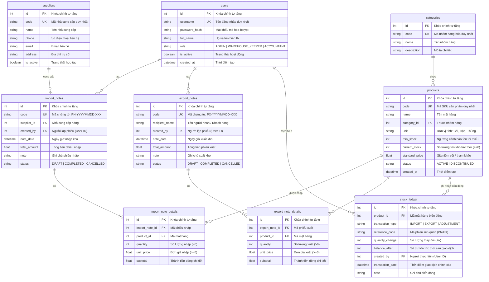

# THIẾT KẾ CƠ SỞ DỮ LIỆU & SƠ ĐỒ ERD CHUẨN (DATABASE DESIGN)

## Đề tài 07: Hệ thống quản lý kho có tích hợp AI

**Mốc đánh giá:** KT1 — Phân tích yêu cầu & Thiết kế hệ thống  
**Học phần:** Triển khai phần mềm & Ứng dụng AI  
**Ngày hoàn thành:** 2026-09-21  

---

## 1. Giới thiệu & Triết lý thiết kế CSDL

Hệ thống quản lý kho yêu cầu tính toàn vẹn và nhất quán dữ liệu ở mức độ tuyệt đối. Mô hình CSDL được thiết kế theo chuẩn hóa dạng chuẩn 3 (3NF), đảm bảo các nguyên tắc kỹ thuật sau:

1. **Toàn vẹn thực thể & quan hệ:** Toàn bộ bảng đều có Khóa chính (`id` tự tăng) và các ràng buộc Khóa ngoại (`FOREIGN KEY`) chỉ rõ hành vi toàn vẹn tham chiếu.
2. **Triệt tiêu nguy cơ tồn kho âm:** Cài đặt ràng buộc kiểm tra cấp độ CSDL:

   ```sql
   CHECK (current_stock >= 0)
   ```

   Ràng buộc này đóng vai trò chốt chặn cuối cùng (Last line of defense), ngăn chặn bất kỳ lỗi code nào làm số lượng tồn kho bị âm.
3. **Audit Trail bất biến qua Thẻ kho (`stock_ledger`):** Mọi giao dịch làm tăng/giảm tồn kho đều bắt buộc sinh một bản ghi kiểm toán ghi nhận số dư tức thời sau giao dịch.
4. **Tách biệt giá vốn và giá niêm yết:** Bảng `products` chỉ lưu giá tiêu chuẩn/tham khảo. Giá nhập thực tế được lưu tại từng dòng chi tiết phiếu nhập `import_note_details` để phục vụ tính giá vốn bình quân/FIFO chính xác.

---

## 2. Sơ đồ Quan hệ Thực thể Chuẩn (Mermaid ERD)



---

## 3. Từ điển Dữ liệu Chi tiết (Data Dictionary)

### 3.1. Bảng `users` (Tài khoản người dùng)

Lưu thông tin nhân sự và phân quyền truy cập hệ thống theo mô hình RBAC.

| Tên trường | Kiểu dữ liệu | Ràng buộc | Mô tả ý nghĩa |
| :--- | :--- | :--- | :--- |
| `id` | INTEGER | PRIMARY KEY, AUTOINCREMENT | Định danh duy nhất của tài khoản |
| `username` | VARCHAR(50) | NOT NULL, UNIQUE, INDEX | Tên đăng nhập hệ thống |
| `password_hash` | VARCHAR(255) | NOT NULL | Chuỗi băm mật khẩu bảo mật (bcrypt) |
| `full_name` | VARCHAR(100) | NOT NULL | Họ và tên đầy đủ của nhân viên |
| `role` | VARCHAR(20) | NOT NULL, DEFAULT 'WAREHOUSE_KEEPER' | Vai trò: `ADMIN`, `WAREHOUSE_KEEPER`, `ACCOUNTANT` |
| `is_active` | BOOLEAN | NOT NULL, DEFAULT TRUE | Trạng thái: `true` (hoạt động), `false` (bị khóa) |
| `created_at` | DATETIME | NOT NULL, DEFAULT CURRENT_TIMESTAMP | Thời điểm khởi tạo tài khoản |

### 3.2. Bảng `categories` (Nhóm hàng hóa)

Phân loại các mặt hàng trong kho để thuận tiện quản lý và lập báo cáo.

| Tên trường | Kiểu dữ liệu | Ràng buộc | Mô tả ý nghĩa |
| :--- | :--- | :--- | :--- |
| `id` | INTEGER | PRIMARY KEY, AUTOINCREMENT | Định danh duy nhất nhóm hàng |
| `code` | VARCHAR(20) | NOT NULL, UNIQUE, INDEX | Mã viết tắt nhóm hàng (ví dụ: `IT`, `OFFICE`, `FOOD`) |
| `name` | VARCHAR(100) | NOT NULL | Tên hiển thị đầy đủ của nhóm hàng |
| `description` | TEXT | NULLABLE | Mô tả chi tiết danh mục |

### 3.3. Bảng `products` (Hàng hóa)

Bảng cốt lõi quản lý thông tin từng mặt hàng và lưu trữ số lượng tồn kho tức thời.

| Tên trường | Kiểu dữ liệu | Ràng buộc | Mô tả ý nghĩa |
| :--- | :--- | :--- | :--- |
| `id` | INTEGER | PRIMARY KEY, AUTOINCREMENT | Định danh duy nhất sản phẩm |
| `code` | VARCHAR(50) | NOT NULL, UNIQUE, INDEX | Mã SKU sản phẩm (ví dụ: `LAPTOP-DELL-5520`) |
| `name` | VARCHAR(200) | NOT NULL | Tên thương mại của sản phẩm |
| `category_id` | INTEGER | NOT NULL, FOREIGN KEY (`categories.id`) | Nhóm hàng tương ứng |
| `unit` | VARCHAR(20) | NOT NULL, DEFAULT 'Cái' | Đơn vị tính: Cái, Hộp, Thùng, Bộ, Kg... |
| `min_stock` | INTEGER | NOT NULL, DEFAULT 10 | Ngưỡng tồn an toàn để kích hoạt cảnh báo |
| `current_stock` | INTEGER | NOT NULL, DEFAULT 0, **`CHECK (current_stock >= 0)`** | **Số lượng tồn kho tức thời (tuyệt đối không âm)** |
| `standard_price` | DECIMAL(12,2) | NOT NULL, DEFAULT 0.0 | Giá niêm yết/tham khảo |
| `status` | VARCHAR(20) | NOT NULL, DEFAULT 'ACTIVE' | Trạng thái: `ACTIVE` hoặc `DISCONTINUED` |
| `created_at` | DATETIME | NOT NULL, DEFAULT CURRENT_TIMESTAMP | Ngày tạo mặt hàng |

### 3.4. Bảng `suppliers` (Nhà cung cấp)

Quản lý danh sách các đối tác cung ứng hàng hóa cho kho.

| Tên trường | Kiểu dữ liệu | Ràng buộc | Mô tả ý nghĩa |
| :--- | :--- | :--- | :--- |
| `id` | INTEGER | PRIMARY KEY, AUTOINCREMENT | Định danh duy nhất nhà cung cấp |
| `code` | VARCHAR(30) | NOT NULL, UNIQUE, INDEX | Mã nhà cung cấp (ví dụ: `NCC-FPT`, `NCC-DGW`) |
| `name` | VARCHAR(150) | NOT NULL | Tên doanh nghiệp/đối tác |
| `phone` | VARCHAR(20) | NULLABLE | Số điện thoại liên lạc |
| `email` | VARCHAR(100) | NULLABLE | Thư điện tử |
| `address` | VARCHAR(255) | NULLABLE | Địa chỉ văn phòng / kho nhà cung cấp |
| `is_active` | BOOLEAN | NOT NULL, DEFAULT TRUE | Trạng thái hợp tác còn hiệu lực hay không |

### 3.5. Bảng `import_notes` (Phiếu nhập kho)

Quản lý chứng từ nhập hàng vào kho từ nhà cung cấp.

| Tên trường | Kiểu dữ liệu | Ràng buộc | Mô tả ý nghĩa |
| :--- | :--- | :--- | :--- |
| `id` | INTEGER | PRIMARY KEY, AUTOINCREMENT | Định danh duy nhất phiếu nhập |
| `code` | VARCHAR(50) | NOT NULL, UNIQUE, INDEX | Số chứng từ: `PN-YYYYMMDD-XXX` |
| `supplier_id` | INTEGER | NOT NULL, FOREIGN KEY (`suppliers.id`) | Đơn vị cung ứng hàng hóa |
| `created_by` | INTEGER | NOT NULL, FOREIGN KEY (`users.id`) | Nhân viên/Thủ kho lập phiếu |
| `note_date` | DATETIME | NOT NULL, DEFAULT CURRENT_TIMESTAMP | Thời điểm lập phiếu nhập |
| `total_amount` | DECIMAL(15,2) | NOT NULL, DEFAULT 0.0 | Tổng giá trị phiếu nhập (VNĐ) |
| `note` | TEXT | NULLABLE | Ghi chú thêm về lô hàng |
| `status` | VARCHAR(20) | NOT NULL, DEFAULT 'COMPLETED' | `DRAFT`, `COMPLETED`, `CANCELLED` |

### 3.6. Bảng `import_note_details` (Chi tiết phiếu nhập kho)

Lưu chi tiết từng mặt hàng, số lượng và đơn giá của từng dòng trong phiếu nhập.

| Tên trường | Kiểu dữ liệu | Ràng buộc | Mô tả ý nghĩa |
| :--- | :--- | :--- | :--- |
| `id` | INTEGER | PRIMARY KEY, AUTOINCREMENT | Định danh duy nhất dòng chi tiết |
| `import_note_id` | INTEGER | NOT NULL, FOREIGN KEY (`import_notes.id`) ON DELETE CASCADE | Thuộc phiếu nhập nào |
| `product_id` | INTEGER | NOT NULL, FOREIGN KEY (`products.id`) | Mặt hàng được nhập |
| `quantity` | INTEGER | NOT NULL, `CHECK (quantity > 0)` | Số lượng nhập vào (phải > 0) |
| `unit_price` | DECIMAL(12,2) | NOT NULL, `CHECK (unit_price >= 0)` | Đơn giá nhập thực tế của lô hàng |
| `subtotal` | DECIMAL(15,2) | NOT NULL | Thành tiền (`quantity * unit_price`) |

### 3.7. Bảng `export_notes` (Phiếu xuất kho)

Quản lý chứng từ xuất hàng hóa ra khỏi kho phục vụ bán lẻ, phân phối hoặc điều chuyển.

| Tên trường | Kiểu dữ liệu | Ràng buộc | Mô tả ý nghĩa |
| :--- | :--- | :--- | :--- |
| `id` | INTEGER | PRIMARY KEY, AUTOINCREMENT | Định danh duy nhất phiếu xuất |
| `code` | VARCHAR(50) | NOT NULL, UNIQUE, INDEX | Số chứng từ: `PX-YYYYMMDD-XXX` |
| `recipient_name` | VARCHAR(100) | NOT NULL | Tên người nhận hàng / Khách hàng |
| `created_by` | INTEGER | NOT NULL, FOREIGN KEY (`users.id`) | Nhân viên/Thủ kho lập phiếu xuất |
| `note_date` | DATETIME | NOT NULL, DEFAULT CURRENT_TIMESTAMP | Thời điểm lập phiếu xuất |
| `total_amount` | DECIMAL(15,2) | NOT NULL, DEFAULT 0.0 | Tổng giá trị hàng xuất (VNĐ) |
| `note` | TEXT | NULLABLE | Ghi chú / lý do xuất kho |
| `status` | VARCHAR(20) | NOT NULL, DEFAULT 'COMPLETED' | `DRAFT`, `COMPLETED`, `CANCELLED` |

### 3.8. Bảng `export_note_details` (Chi tiết phiếu xuất kho)

Lưu danh sách chi tiết các mặt hàng và số lượng xuất của từng dòng trong phiếu xuất.

| Tên trường | Kiểu dữ liệu | Ràng buộc | Mô tả ý nghĩa |
| :--- | :--- | :--- | :--- |
| `id` | INTEGER | PRIMARY KEY, AUTOINCREMENT | Định danh duy nhất dòng chi tiết |
| `export_note_id` | INTEGER | NOT NULL, FOREIGN KEY (`export_notes.id`) ON DELETE CASCADE | Thuộc phiếu xuất nào |
| `product_id` | INTEGER | NOT NULL, FOREIGN KEY (`products.id`) | Mặt hàng xuất kho |
| `quantity` | INTEGER | NOT NULL, `CHECK (quantity > 0)` | Số lượng xuất kho (phải > 0) |
| `unit_price` | DECIMAL(12,2) | NOT NULL, `CHECK (unit_price >= 0)` | Đơn giá xuất |
| `subtotal` | DECIMAL(15,2) | NOT NULL | Thành tiền (`quantity * unit_price`) |

### 3.9. Bảng `stock_ledger` (Thẻ kho / Sổ kiểm toán tồn kho)

Bảng bất biến (append-only) ghi lại từng biến động tăng/giảm tồn kho của từng sản phẩm.

| Tên trường | Kiểu dữ liệu | Ràng buộc | Mô tả ý nghĩa |
| :--- | :--- | :--- | :--- |
| `id` | INTEGER | PRIMARY KEY, AUTOINCREMENT | Định danh duy nhất bản ghi thẻ kho |
| `product_id` | INTEGER | NOT NULL, FOREIGN KEY (`products.id`), INDEX | Mặt hàng có biến động số lượng |
| `transaction_type` | VARCHAR(20) | NOT NULL | Loại giao dịch: `IMPORT`, `EXPORT`, `ADJUSTMENT` |
| `reference_code` | VARCHAR(50) | NOT NULL, INDEX | Mã chứng từ gốc (`PN-XXXX` hoặc `PX-XXXX`) |
| `quantity_change` | INTEGER | NOT NULL | Số lượng biến động: dương (`+`) khi nhập, âm (`-`) khi xuất |
| `balance_after` | INTEGER | NOT NULL, `CHECK (balance_after >= 0)` | Số lượng tồn kho sau giao dịch |
| `created_by` | INTEGER | NOT NULL, FOREIGN KEY (`users.id`) | Tài khoản thực hiện giao dịch |
| `transaction_date` | DATETIME | NOT NULL, DEFAULT CURRENT_TIMESTAMP, INDEX | Thời điểm phát sinh giao dịch |
| `note` | VARCHAR(255) | NULLABLE | Diễn giải chi tiết biến động |

---

## 4. Cơ chế Đảm bảo Toàn vẹn Dữ liệu & Giao dịch ACID

### 4.1. Quy trình Transaction khi Nhập kho

```python
# Toàn bộ khối lệnh chạy trong một Database Transaction
db.begin()
try:
    # 1. Tạo phiếu nhập (import_notes)
    # 2. Với mỗi sản phẩm:
    #    - Lưu chi tiết (import_note_details)
    #    - Cập nhật tăng: product.current_stock += item.quantity
    #    - Thêm bản ghi thẻ kho: stock_ledger(product_id, qty_change=+quantity, balance_after=product.current_stock)
    db.commit()
except Exception:
    db.rollback()
    raise
```

### 4.2. Quy trình Transaction khi Xuất kho (Chống Tồn Kho Âm)

```python
db.begin()
try:
    # 1. Khóa/Kiểm tra số lượng tồn kho từng sản phẩm
    for item in export_items:
        product = get_product_for_update(db, item.product_id)
        if product.current_stock < item.quantity:
            # Vi phạm quy tắc tồn âm: Rollback tức thời
            raise InsufficientStockError(
                f"Sản phẩm {product.name} (SKU: {product.code}) chỉ còn {product.current_stock}, "
                f"không đủ xuất {item.quantity}!"
            )
        # 2. Trừ số lượng tồn kho
        product.current_stock -= item.quantity
        # 3. Ghi nhận chi tiết phiếu xuất & Thẻ kho
        record_stock_ledger(product_id, qty_change=-item.quantity, balance_after=product.current_stock)
    db.commit()
except Exception:
    db.rollback()
    raise
```

---

## 5. Kết luận

Thiết kế CSDL trên đảm bảo tính chuẩn hóa 3NF, đáp ứng trọn vẹn nghiệp vụ quản lý kho của Đề tài 07, triệt tiêu khả năng phát sinh tồn kho âm và cung cấp nguồn dữ liệu lịch sử chuẩn xác cho Module AI phân tích.
