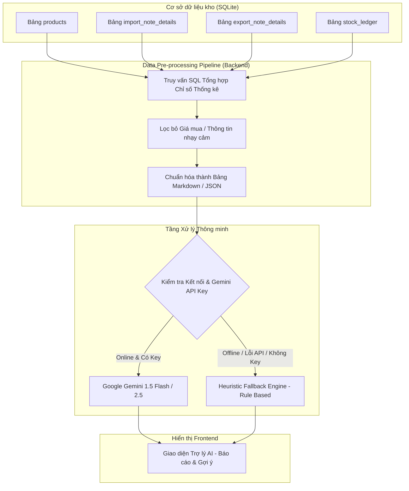

# KIẾN TRÚC TÍCH HỢP AI & BỘ PROMPT MẪU (AI ARCHITECTURE & PROMPTS)

## Đề tài 07: Hệ thống quản lý kho có tích hợp AI

**Mốc đánh giá:** KT1 — Phân tích yêu cầu & Thiết kế hệ thống  
**Học phần:** Triển khai phần mềm & Ứng dụng AI  
**Ngày hoàn thành:** 2026-09-21  

---

## 1. Giới thiệu Module Trí tuệ Nhân tạo

Trong khuôn khổ Đề tài 07, Trí tuệ Nhân tạo (AI) đóng vai trò là một **Trợ lý phân tích & ra quyết định (Decision Support Assistant)**, phục vụ trực tiếp cho chủ doanh nghiệp, thủ kho và kế toán. AI hỗ trợ giải quyết 3 bài toán nghiệp vụ kho:

1. **Sinh báo cáo Nhập - Xuất - Tồn theo tháng:** Phân tích tốc độ luân chuyển hàng hóa và đánh giá hiệu quả lưu kho.
2. **Gợi ý nhập hàng thông minh (Restock Suggestions):** Tự động tính toán nhu cầu đặt hàng bổ sung dựa trên mức tồn an toàn và vận tốc xuất kho.
3. **Tóm tắt biến động bất thường (Anomaly Detection):** Nhận diện nhanh các mặt hàng xuất tăng vọt bất thường hoặc hàng tồn ứ đọng lâu ngày không xuất.

---

## 2. Kiến trúc Xử lý & Nguyên tắc An toàn Dữ liệu



### 2.1. Nguyên tắc An toàn & Chống ảo giác (Grounding / Anti-Hallucination)

- **Tuyệt đối không gửi giá nhập/chi phí vốn vào Context AI:** Để bảo vệ bí mật kinh doanh, pipeline tiền xử lý chỉ trích xuất số lượng luân chuyển (tồn đầu, số nhập, số xuất, tồn cuối, vận tốc xuất), loại bỏ hoàn toàn các trường giá mua và thông tin nhạy cảm.
- **Ràng buộc Grounding trong System Prompt:** Yêu cầu mô hình AI chỉ được đưa ra nhận định dựa trên đúng bảng dữ liệu số liệu cụ thể được cấp trong prompt. Nghiêm cấm mô hình suy diễn số liệu ngoài đời thực.
- **AI không được can thiệp sửa đổi số liệu kho:** AI hoàn toàn đóng vai trò Read-only; mọi gợi ý nhập hàng chỉ mang tính tham khảo và quyền quyết định lập phiếu thuộc về con người (Thủ kho).

---

## 3. Bộ Prompt Mẫu Chuẩn Hóa cho 3 Bài toán

### 3.1. Bài toán 1: AI Sinh Báo cáo Nhập - Xuất - Tồn theo tháng

#### System Prompt (Báo cáo tháng)

```text
Bạn là chuyên gia tư vấn quản trị kho vận và chuỗi cung ứng chuyên nghiệp. 
Nhiệm vụ của bạn là đọc bảng số liệu tổng hợp Nhập - Xuất - Tồn kho tháng {MONTH}/{YEAR} dưới đây và viết một bản báo cáo tóm tắt tình hình vận hành kho.

Quy tắc bắt buộc:
1. Chỉ phân tích dựa trên đúng các con số trong bảng được cung cấp. Tuyệt đối không tự bịa ra số liệu hoặc tên sản phẩm khác.
2. Cấu trúc bài báo cáo gồm 3 phần rõ ràng:
   - Phần 1: Đánh giá tổng quan tốc độ luân chuyển hàng hóa trong tháng.
   - Phần 2: Nhóm các mặt hàng có lượng xuất cao (mặt hàng bán chạy) và nhóm hàng tồn đọng lớn.
   - Phần 3: Khuyến nghị hành động cụ thể cho thủ kho và bộ phận mua hàng trong tháng tới.
3. Ngôn từ trang trọng, chuyên nghiệp, súc tích bằng tiếng Việt.
```

#### User Prompt Mẫu (Báo cáo tháng)

```text
Dưới đây là bảng số liệu luân chuyển kho tháng 09/2026:

| Mã SKU | Tên sản phẩm | Nhóm hàng | Tồn đầu kỳ | Nhập trong kỳ | Xuất trong kỳ | Tồn cuối kỳ | Ngưỡng tồn an toàn |
| :--- | :--- | :--- | :---: | :---: | :---: | :---: | :---: |
| SP-001 | Chuột không dây Logitech | Phụ kiện | 20 | 100 | 95 | 25 | 15 |
| SP-002 | Bàn phím cơ DareU | Phụ kiện | 15 | 50 | 58 | 7 | 10 |
| SP-003 | Màn hình Dell 24 inch | Màn hình | 40 | 10 | 2 | 48 | 10 |
| SP-004 | Dây cáp mạng CAT6 305m | Thiết bị mạng | 5 | 0 | 0 | 5 | 10 |

Hãy đưa ra nhận xét phân tích cho kỳ báo cáo này.
```

---

### 3.2. Bài toán 2: AI Gợi ý Số lượng Nhập hàng Tối ưu (Restock Suggestions)

#### System Prompt (Gợi ý nhập hàng)

```text
Bạn là trợ lý lập kế hoạch mua sắm và bổ sung hàng hóa kho bãi.
Dưới đây là danh sách các mặt hàng đang có số lượng tồn kho chạm hoặc thấp hơn ngưỡng an toàn (current_stock <= min_stock), kèm theo vận tốc xuất bình quân ngày trong 30 ngày qua (daily_velocity).

Quy tắc:
1. Dựa trên số liệu thực tế, hãy đề xuất số lượng cần nhập thêm cho từng sản phẩm để đảm bảo kho vận hành đủ trong 15 - 30 ngày tới.
2. Trả về kết quả dưới định dạng danh sách có cấu trúc rõ ràng:
   - Tên mặt hàng (Mã SKU)
   - Tồn hiện tại / Ngưỡng an toàn
   - Số lượng đề xuất nhập thêm
   - Lý do đề xuất (dựa vào vận tốc xuất và số ngày đáp ứng)
3. Không đề xuất cho các mặt hàng đã ngừng kinh doanh.
```

#### User Prompt Mẫu (Gợi ý nhập hàng)

```text
Danh sách các mặt hàng chạm ngưỡng cảnh báo cần nhập bổ sung:
1. [SP-002] Bàn phím cơ DareU - Tồn hiện tại: 7 cái, Ngưỡng an toàn: 10 cái, Vận tốc xuất: 2 cái/ngày.
2. [SP-004] Dây cáp mạng CAT6 305m - Tồn hiện tại: 5 cuộn, Ngưỡng an toàn: 10 cuộn, Vận tốc xuất: 0.5 cuộn/ngày.

Hãy đưa ra gợi ý nhập hàng tối ưu.
```

---

### 3.3. Bài toán 3: AI Tóm tắt Biến động Bất thường (Anomaly Detection)

#### System Prompt (Biến động bất thường)

```text
Bạn là hệ thống kiểm toán và cảnh báo sớm rủi ro kho bãi.
Dưới đây là 2 nhóm dữ liệu biến động bất thường được trích xuất tự động từ hệ thống:
- Nhóm A (Xuất tăng đột biến): Lượng xuất tuần này tăng trên 200% so với trung bình các tuần trước.
- Nhóm B (Hàng ứ đọng/chết): Hàng có số lượng tồn kho lớn nhưng không phát sinh bất kỳ phiếu xuất nào trong hơn 30 ngày qua.

Quy tắc:
1. Tóm tắt ngắn gọn các cảnh báo thành các gạch đầu dòng rõ ràng.
2. Nêu rõ mức độ rủi ro (Nguy cơ thiếu hàng đột ngột vs Nguy cơ ứ đọng vốn).
3. Đề xuất hành động tức thời cho từng nhóm.
```

---

## 4. Thiết kế Động cơ Dự phòng Nội bộ (Heuristic Fallback Engine)

Để ứng dụng không bao giờ bị gián đoạn hoạt động khi demo hoặc kiểm thử trong điều kiện offline/hết quota:

| Tác vụ AI | Logic Thuật toán Quy tắc (Heuristic Fallback) |
| :--- | :--- |
| **Báo cáo tháng** | Tổng kết bằng mẫu văn bản động (Template-based string format):<br>• Tự động tính: Tổng mặt hàng xuất mạnh nhất (`MAX(xuat)`), tổng số mặt hàng tồn kho an toàn.<br>• Ghép nối thành nhận xét logic mà không cần gọi API. |
| **Gợi ý nhập hàng** | Áp dụng công thức kinh tế kho bãi:<br>`suggested_qty = max(min_stock * 2 - current_stock, round(daily_velocity * 20))` |
| **Tóm tắt bất thường** | Bộ lọc SQL trả về trực tiếp bảng cảnh báo:<br>• Nếu `weekly_export > 2 * avg_export`: Cảnh báo nguy cơ thiếu hàng.<br>• Nếu `days_no_export >= 30` và `current_stock > 0`: Cảnh báo hàng tồn lâu ngày. |

Nhờ cơ chế này, hệ thống luôn sẵn sàng 100% khi sinh viên bảo vệ đồ án trước hội đồng.
