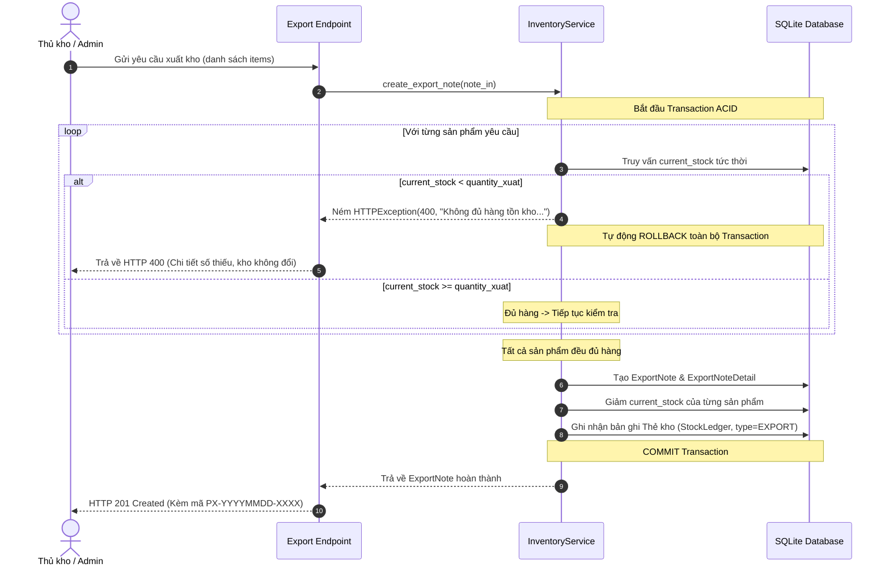

# THIẾT KẾ GIAO DỊCH DATABASE (ACID TRANSACTION) VÀ CƠ CHẾ CHỐNG TỒN KHO ÂM (BÀI KT2)

## Đề tài 07: Hệ thống quản lý kho có tích hợp AI

---

## 1. ĐẶT VẤN ĐỀ & NGUYÊN TẮC BẤT BIẾN (INVARIANTS)

Trong quản trị kho bãi doanh nghiệp, sai sót về số liệu tồn kho là nguyên nhân trực tiếp dẫn đến thất thoát tài sản, ngưng trệ chuỗi cung ứng và vi phạm chuẩn mực kế toán. Hệ thống quản lý kho (Đề tài 07) được thiết kế dựa trên **3 nguyên tắc bất biến**:

1. **Ràng buộc không âm tuyệt đối:** Số lượng tồn kho tức thời (`current_stock`) của mọi mặt hàng tại mọi thời điểm bắt buộc phải thỏa mãn:
   $$\text{current\_stock} \ge 0$$
   Ràng buộc này được bảo vệ đa tầng: từ tầng giao diện Frontend, tầng Schema Pydantic, tầng Dịch vụ `InventoryService`, và tầng sâu nhất là CSDL với `CheckConstraint("current_stock >= 0")`.
2. **Nguyên tắc đối ứng chứng từ:** Tồn kho không thể tự nhiên tăng hay giảm. Mọi biến động đều phải bắt nguồn từ một chứng từ có căn cứ pháp lý:
   - Tăng kho $\rightarrow$ Phiếu nhập kho (`ImportNote`).
   - Giảm kho $\rightarrow$ Phiếu xuất kho (`ExportNote`).
   - Cân bằng sai lệch $\rightarrow$ Phiếu điều chỉnh kiểm kê (`StockAdjustment`).
3. **Tính bất biến của sổ kiểm toán (Audit Trail):** Bảng Thẻ kho (`stock_ledger`) là sổ cái kế toán chỉ ghi thêm (Append-only). Không một người dùng hay tiến trình nào được phép sửa hoặc xóa lịch sử Thẻ kho.

---

## 2. THIẾT KẾ LUỒNG GIAO DỊCH DATABASE (ACID TRANSACTION)

Toàn bộ các thao tác Nhập, Xuất và Điều chỉnh kho đều được đóng gói trong một **Database Transaction** duy nhất nhằm bảo đảm 4 tính chất kinh điển:

```text
                  ┌────────────────────────────────────────┐
                  │          HTTP Request (API)            │
                  └──────────────────┬─────────────────────┘
                                     │
                                     ▼
                  ┌────────────────────────────────────────┐
                  │    InventoryService (Transaction)      │
                  ├────────────────────────────────────────┤
                  │  1. Kiểm tra điều kiện nghiệp vụ       │
                  │  2. Chặn tồn âm (Nếu Xuất kho)         │
                  │  3. Tạo Phiếu & Chi tiết chứng từ      │
                  │  4. Cập nhật current_stock sản phẩm    │
                  │  5. Ghi sổ kiểm toán StockLedger       │
                  └─────────┬────────────────────┬─────────┘
             Thành công     │                    │ Lỗi / Thiếu hàng
                            ▼                    ▼
                  ┌──────────────────┐  ┌──────────────────┐
                  │      COMMIT      │  │     ROLLBACK     │
                  │ (Dữ liệu lưu DB) │  │  (Hủy sạch 100%) │
                  └──────────────────┘  └──────────────────┘
```

- **Atomicity (Nguyên tử):** Toàn bộ các bước (Tạo phiếu + Tạo chi tiết + Đổi tồn kho + Ghi thẻ kho) thành công cùng nhau, hoặc hủy sạch 100%. Không bao giờ xảy ra tình trạng "phiếu đã tạo nhưng kho chưa tăng" hay "kho đã trừ nhưng phiếu chưa lưu".
- **Consistency (Nhất quán):** Mọi chuyển dịch trạng thái đều tuân thủ chặt chẽ các khóa ngoại và CheckConstraint.
- **Isolation (Cô lập):** Dữ liệu cập nhật tồn kho được cô lập trong phiên giao dịch, tránh hiện tượng dirty read.
- **Durability (Bền vững):** Một khi transaction đã COMMIT, dữ liệu được ghi bền vững vào đĩa cứng.

---

## 3. CƠ CHẾ CHỐNG TỒN KHO ÂM (NEGATIVE STOCK PREVENTION)

### 3.1. Luồng xuất kho (Atomic Stock Check)

Khi người dùng gửi yêu cầu xuất kho (`POST /api/v1/export-notes`):



---

## 4. CƠ CHẾ HỦY PHIẾU AN TOÀN & GUARD-CHECK CHỐNG TỒN ÂM

### 4.1. Vấn đề thực tế khi hủy phiếu nhập cũ

Một lỗ hổng nghiệp vụ nguy hiểm:
> **Tình huống:**
>
> - Ngày 01: Nhập 100 sản phẩm A (Tồn kho = 100).
> - Ngày 05: Xuất 90 sản phẩm A cho khách hàng (Tồn kho còn 10).
> - Ngày 10: Người dùng bấm "Hủy phiếu nhập Ngày 01".
> - Nếu hệ thống ngây thơ hoàn tác trừ đi 100 cái, tồn kho sẽ thành: $10 - 100 = -90$ $\rightarrow$ **Âm kho nghiêm trọng!**

### 4.2. Giải pháp Guard-check (Phương án B)

Khi người dùng gọi `POST /api/v1/import-notes/{id}/cancel`:

1. Hệ thống duyệt qua tất cả mặt hàng trong phiếu nhập.
2. Kiểm tra điều kiện:
   $$\text{product.current\_stock} < \text{detail.quantity}$$
3. Nếu **bất kỳ sản phẩm nào không đủ tồn để trừ ngược lại**:
   - Lập tức **từ chối hủy** và trả về mã lỗi **HTTP 400 Bad Request**:
     > *"Không thể hủy phiếu nhập vì mặt hàng 'X' chỉ còn tồn Y cái trong kho (nhỏ hơn Z cái cần hoàn tác) do đã phát sinh các phiếu xuất hàng tiếp sau. Vui lòng sử dụng tính năng 'Điều chỉnh tồn kho (Stock Adjustment)' để cân bằng số lượng thực tế."*
   - Toàn bộ trạng thái phiếu nhập và số tồn kho giữ nguyên 100%.

### 4.3. Lối thoát nghiệp vụ: Phiếu Điều chỉnh Tồn kho (`StockAdjustment`)

Khi Guard-check từ chối hủy phiếu nhập vì lý do hàng đã xuất, kế toán hoặc thủ kho sẽ sử dụng endpoint:
`POST /api/v1/stock-ledger/adjust`

- Cung cấp số lượng tồn thực tế sau kiểm kê (`actual_stock`) và lý do (`reason`).
- Hệ thống cập nhật `current_stock = actual_stock`, đồng thời ghi một dòng Thẻ kho `ADJUSTMENT` với số lượng chênh lệch $\pm\Delta$.
- Đây là giải pháp **chuẩn mực theo thông tư kế toán và các hệ thống ERP quốc tế (SAP, Odoo, MISA)**, đảm bảo sổ sách kế toán không bao giờ bị can thiệp hồi tố mờ ám.

---

## 5. CƠ CHẾ SINH MÃ TỰ ĐỘNG & RETRY PATTERN (OPTIMISTIC CONCURRENCY)

- **Định dạng mã chuẩn:**
  - Phiếu nhập: `PN-YYYYMMDD-XXXX` (VD: `PN-20260922-0001`)
  - Phiếu xuất: `PX-YYYYMMDD-XXXX` (VD: `PX-20260922-0001`)
- **Xử lý xung đột đồng thời (Race Condition):**
  - Cột `code` trong bảng `ImportNote` và `ExportNote` được gắn ràng buộc `unique=True`.
  - Nếu có 2 yêu cầu cùng lúc tạo phiếu ở cùng một mili-giây, `InventoryService` áp dụng **Retry Pattern** (thử lại tối đa 3 lần). Khi CSDL ném lỗi `IntegrityError` do trùng mã, transaction tự rollback và sinh mã thứ tự kế tiếp rồi thử lại ngay lập tức.
  - Kết quả: Xung đột được giải quyết hoàn toàn trong suốt, người dùng không bao giờ gặp lỗi hệ thống do đụng độ mã.

---

## 6. CÔNG THỨC KẾ TOÁN BÁO CÁO NHẬP - XUẤT - TỒN

Báo cáo Nhập - Xuất - Tồn (`/reports/inventory-summary`) được tính toán trực tiếp từ dòng thời gian trong `StockLedger`:

$$\text{Tồn cuối kỳ} = \text{Tồn đầu kỳ} + \text{Tổng Nhập trong kỳ} - \text{Tổng Xuất trong kỳ}$$

- **Tồn đầu kỳ:** Số dư `balance_after` của bản ghi Thẻ kho gần nhất trước ngày `from_date`.
- **Tổng Nhập:** Tổng các biến động `quantity_change > 0` trong khoảng `[from_date, to_date]`.
- **Tổng Xuất:** Tổng giá trị tuyệt đối các biến động `quantity_change < 0` trong khoảng `[from_date, to_date]`.
- **Tồn cuối kỳ:** Số lượng thực tế tại thời điểm `to_date`.
- Công thức này bảo đảm **tính cân đối kế toán 100%**, sẵn sàng giải trình thuyết phục trước hội đồng đánh giá đồ án.
