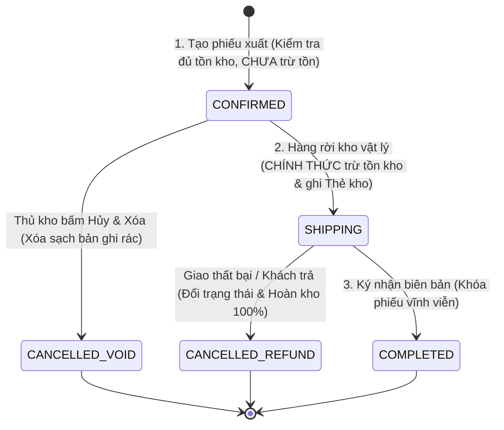
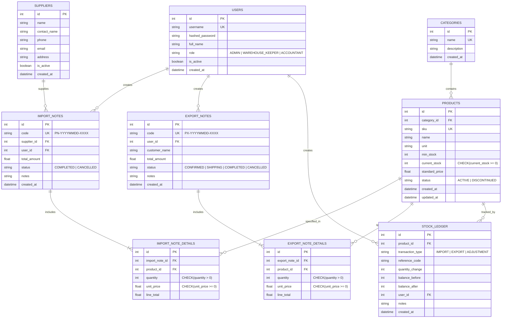
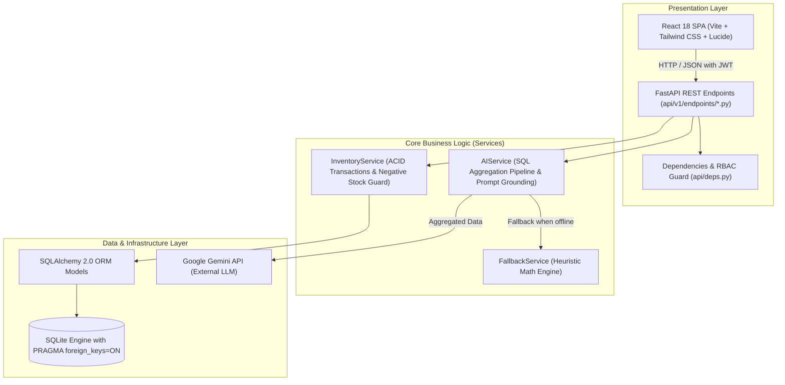

# BÁO CÁO KỸ THUẬT TỔNG KẾT ĐỒ ÁN (FINAL TECHNICAL REPORT)

## HỆ THỐNG QUẢN LÝ KHO THÔNG MINH TÍCH HỢP TRÍ TUỆ NHÂN TẠO (WMS AI)
### Đề tài 07 — Phiên bản chuẩn hóa Học phần & Nghiệm thu Hội đồng (2026)

> **Văn bản tổng hợp:** Báo cáo kỹ thuật chi tiết đã được biên soạn và chuẩn hóa toàn diện trong tệp văn bản:
> 📄 [`Bao_Cao_Kien_Truc_He_Thong_Quan_Ly_Kho.docx`](file:///E:/gemini/Bao_Cao_Kien_Truc_He_Thong_Quan_Ly_Kho.docx) (kèm bản sao lưu tại `docs/SDLC/final/` và `docs/submissions/final/`).
> Tài liệu dưới đây tóm lược kiến trúc, đặc tả nghiệp vụ, cơ chế an toàn và kết quả kiểm định của toàn bộ dự án.

---

## MỤC LỤC TỔNG QUAN

1. [Chương 1: Giới thiệu dự án & Phạm vi hệ thống](#chương-1-giới-thiệu-dự-án--phạm-vi-hệ-thống)
2. [Chương 2: Bối cảnh, Thách thức & Ma trận phân quyền RBAC](#chương-2-bối-cảnh-thách-thức--ma-trận-phân-quyền-rbac)
3. [Chương 3: Nghiệp vụ cốt lõi & Cỗ máy trạng thái xuất kho 3 bước](#chương-3-nghiệp-vụ-cốt-lõi--cỗ-máy-trạng-thái-xuất-kho-3-bước)
4. [Chương 4: Thiết kế Cơ sở Dữ liệu chuẩn 3NF & Ràng buộc toàn vẹn](#chương-4-thiết-kế-cơ-sở-dữ-liệu-chuẩn-3nf--ràng-buộc-toàn-vẹn)
5. [Chương 5: Thiết kế Kiến trúc Hệ thống Clean Architecture 3 tầng](#chương-5-thiết-kế-kiến-trúc-hệ-thống-clean-architecture-3-tầng)
6. [Chương 6: Cơ chế Chốt chặn kép Chống tồn kho âm (ACID Guarantee)](#chương-6-cơ-chế-chốt-chặn-kép-chống-tồn-kho-âm-acid-guarantee)
7. [Chương 7: Phân hệ AI Copilot & Heuristic Fallback Engine](#chương-7-phân-hệ-ai-copilot--heuristic-fallback-engine)
8. [Chương 8: Thiết kế Giao diện Công thái học (Ergonomic Frontend)](#chương-8-thiết-kế-giao-diện-công-thái-học-ergonomic-frontend)
9. [Chương 9: Chiến lược Kiểm thử tự động & Đảm bảo chất lượng](#chương-9-chiến-lược-kiểm-thử-tự-động--đảm-bảo-chất-lượng)
10. [Chương 10: Kết luận, Giá trị thực tiễn & Hướng phát triển](#chương-10-kết-luận-giá-trị-thực-tiễn--hướng-phát-triển)

---

## CHƯƠNG 1: GIỚI THIỆU DỰ ÁN & PHẠM VI HỆ THỐNG

### 1.1. Mục đích dự án
Dự án nhằm xây dựng một giải pháp Quản lý Kho bãi Hiện đại (Warehouse Management System - WMS AI) dành riêng cho các doanh nghiệp vừa và nhỏ (SMEs). Ứng dụng kết hợp giữa nền tảng phần mềm quản trị chặt chẽ (FastAPI, SQLite ACID, React 18 Tailwind) và sức mạnh phân tích dự báo của Trí tuệ Nhân tạo thế hệ mới (Google Gemini API), giúp tối ưu hóa luồng chu chuyển hàng hóa, hạn chế tối đa thất thoát và nâng cao năng lực ra quyết định của nhà quản lý.

### 1.2. Phạm vi hệ thống (System Scope)
- **Quản lý Danh mục & Hàng hóa:** Phân loại nhóm hàng (Category), sản phẩm (Product) với ngưỡng an toàn `min_stock` và giá tiêu chuẩn.
- **Quản lý Nhà cung cấp (Suppliers):** Quản lý đối tác cung ứng, bảo toàn lịch sử giao dịch bằng soft-deactivation.
- **Quản lý Phiếu Nhập kho (Import Notes):** Nhập hàng đa dòng, lưu đơn giá vốn thực tế, tăng tồn kho và ghi Sổ cái thẻ kho qua giao dịch nguyên tử (ACID).
- **Cỗ máy Trạng thái Xuất kho 3 bước (3-Stage Export Flow):** Quy trình chuẩn gồm `CONFIRMED` $\rightarrow$ `SHIPPING` $\rightarrow$ `COMPLETED`, hỗ trợ hủy phiếu hoàn kho.
- **Sổ cái Thẻ kho bất biến (Immutable Stock Ledger):** Lưu vết kiểm toán mọi biến động (Audit Trail), tuyệt đối không cho phép sửa/xóa; hỗ trợ điều chỉnh kiểm kê thực tế.
- **Trợ lý Thông minh AI Copilot:**
  - Báo cáo điều hành Nhập - Xuất - Tồn hàng tháng.
  - Gợi ý bổ sung hàng thông minh dựa trên vận tốc bán (Velocity).
  - Phát hiện dị thường: Hàng xuất đột biến (`SURGE_EXPORT`) và Hàng tồn chết (`DEAD_STOCK`).
- **Cơ chế Dự phòng Heuristic Fallback Engine:** Đảm bảo hệ thống duy trì 100% chức năng phân tích ngay cả khi mất kết nối Internet hoặc lỗi dịch vụ AI ngoài.

---

## CHƯƠNG 2: BỐI CẢNH, THÁCH THỨC & MA TRẬN PHÂN QUYỀN RBAC

### 2.1. Ba bài toán nhức nhối của kho bãi truyền thống
1. **Lỗi tồn kho âm:** Do các thao tác xuất kho không được khóa giao dịch hoặc kiểm tra lỏng lẻo, dẫn đến số liệu phần mềm âm trong khi thực tế không còn hàng.
2. **Giam giữ hàng ảo (Phantom Stock Hold):** Nhiều phần mềm tự ý trừ tồn kho ngay khi vừa tạo đơn hàng, khiến kho bị "đóng băng" dù đơn chưa hề xuất kho vật lý.
3. **Thao tác SKU rườm rà & Nhập liệu sai sót:** Bắt buộc thủ kho phải nhớ chính xác mã SKU dài dòng dẫn đến thao tác chậm chạp và dễ chọn nhầm sản phẩm.

### 2.2. Ma trận Phân quyền 3 Cấp độ (RBAC Matrix)

| Chức năng / Quyền hạn | Quản trị viên (ADMIN) | Thủ kho (WAREHOUSE_KEEPER) | Kế toán (ACCOUNTANT) |
| :--- | :---: | :---: | :---: |
| Quản lý tài khoản người dùng (`/users`) | ✅ Toàn quyền | ❌ Chặn | ❌ Chặn |
| Quản lý Danh mục, Hàng hóa, NCC | ✅ Toàn quyền | ✅ Thêm / Sửa / Xem | 👁️ Chỉ xem (Read-only) |
| Lập & Hủy Phiếu Nhập kho | ✅ Toàn quyền | ✅ Lập / Hủy phiếu | 👁️ Chỉ xem |
| Lập & Điều phối Phiếu Xuất kho | ✅ Toàn quyền | ✅ Điều phối 3 trạng thái | 👁️ Chỉ xem |
| Thực hiện Điều chỉnh Kiểm kê | ✅ Phê duyệt & Điều chỉnh | ✅ Báo cáo & Cân đối | 👁️ Chỉ xem |
| Tra cứu Báo cáo Nhập-Xuất-Tồn & Thẻ kho | ✅ Đầy đủ | ✅ Đầy đủ | ✅ Đầy đủ (chuyên trách) |
| Phân hệ Trợ lý AI & Báo cáo điều hành | ✅ Toàn quyền phân tích | ✅ Nhận khuyến nghị nhập | ✅ Phân tích số liệu tồn |

---

## CHƯƠNG 3: NGHIỆP VỤ CỐT LÕI & CỖ MÁY TRẠNG THÁI XUẤT KHO 3 BƯỚC

### 3.1. Quy trình Nhập kho Chuẩn (Import Workflow)
1. Thủ kho chọn Nhà cung cấp và lập phiếu nhập gồm danh sách sản phẩm, số lượng và đơn giá nhập thực tế.
2. Hệ thống sinh mã phiếu chuẩn `PN-YYYYMMDD-XXXX` (với cơ chế Retry chống trùng mã khi tải cao).
3. Mở giao dịch CSDL: Ghi phiếu nhập, ghi chi tiết phiếu nhập, cộng `current_stock` tương ứng cho từng mặt hàng, ghi nhận bản ghi biến động dương vào Sổ cái thẻ kho (`stock_ledger`).
4. Commit giao dịch thành công. Nếu có bất kỳ lỗi nào, Rollback toàn bộ để đảm bảo tính nhất quán.

### 3.2. Cỗ máy Trạng thái Xuất kho 3 Bước (3-Stage State Machine)

- **Giai đoạn 1 (`CONFIRMED`):** Tiếp nhận yêu cầu xuất hàng. Hệ thống xác nhận đủ tồn khả dụng nhưng **chưa trừ tồn kho thực tế**. Điều này loại bỏ hoàn toàn hiện tượng giữ hàng ảo.
- **Giai đoạn 2 (`SHIPPING`):** Khi kiện hàng được bốc xếp lên xe rời kho, thủ kho kích hoạt trạng thái "Bắt đầu giao hàng". Hệ thống thực hiện trừ `current_stock` và ghi bản ghi xuất vào Thẻ kho. Nếu giao hàng thất bại, có thể hủy phiếu: hệ thống tự động hoàn trả 100% số lượng về kho và ghi Thẻ kho hoàn ứng.
- **Giai đoạn 3 (`COMPLETED`):** Khách hàng đã nhận và ký biên bản. Phiếu chuyển sang Hoàn thành và bị khóa chỉnh sửa vĩnh viễn.

---

## CHƯƠNG 4: THIẾT KẾ CƠ SỞ DỮ LIỆU CHUẨN 3NF & RÀNG BUỘC TOÀN VẸN

### 4.1. Sơ đồ Quan hệ Thực thể (ERD 9 Bảng)

---

## CHƯƠNG 5: THIẾT KẾ KIẾN TRÚC HỆ THỐNG CLEAN ARCHITECTURE 3 TẦNG

---

## CHƯƠNG 6: CƠ CHẾ CHỐT CHẶN KÉP CHỐNG TỒN KHO ÂM (ACID GUARANTEE)

Hệ thống thiết kế cơ chế bảo vệ 2 lớp (Two-Tier Defense) loại trừ 100% rủi ro tồn âm:

1. **Chốt chặn Tầng 1 — Service Validation Logic:**
   - Trong giao dịch trừ kho, hàm `InventoryService.create_export()` truy vấn mặt hàng và so sánh ngay lập tức:
     $$\text{Nếu } \text{quantity} > \text{product.current\_stock} \implies \text{Ném ngoại lệ HTTP 400 (Bad Request)}$$
   - Thông báo rõ ràng: `"Không đủ hàng xuất. Tồn hiện tại: X, yêu cầu: Y"`.

2. **Chốt chặn Tầng 2 — Database CheckConstraint:**
   - Tầng cơ sở dữ liệu định nghĩa ràng buộc cứng tại bảng `products`:
     `CheckConstraint('current_stock >= 0', name='check_positive_stock')`
   - Kể cả khi có lỗi lập trình hay truy vấn ngoài luồng, cơ sở dữ liệu sẽ lập tức từ chối và Rollback giao dịch nếu số dư nhỏ hơn 0.

---

## CHƯƠNG 7: PHÂN HỆ AI COPILOT & HEURISTIC FALLBACK ENGINE

### 7.1. Ba Năng lực Phân tích AI Chuyên sâu
1. **Báo cáo Tháng Thông minh (Executive Inventory Report):**
   - Đánh giá tổng giá trị xuất, cơ cấu hàng bán chạy và đưa ra 3 khuyến nghị điều hành thực tế.
2. **Gợi ý Bổ sung Hàng hóa (Reorder Suggestions):**
   - Tính toán vận tốc bán trong 30 ngày (Sales Velocity: sản phẩm/ngày), dự báo số ngày tồn còn lại và đề xuất chính xác số lượng cần nhập:
     $$\text{Suggested Qty} = \max\left(0, 2 \times \text{min\_stock} - \text{current\_stock}\right)$$
3. **Phát hiện Dị thường Biến động (Anomaly Detection):**
   - Nhận diện xuất đột biến (`SURGE_EXPORT` khi lượng xuất tăng >200% so với trung bình 30 ngày).
   - Nhận diện hàng chết / ứ đọng (`DEAD_STOCK` khi không có giao dịch xuất trong hơn 30 ngày).

### 7.2. Bảo mật Thông tin Tuyệt đối & Chống Ảo giác (Anti-Hallucination)
- **Tách lọc giá vốn:** Toàn bộ thông tin giá nhập (`unit_price` trong phiếu nhập) đều bị loại bỏ 100% tại `ai_service.py` trước khi cấu trúc ngữ cảnh gửi sang Gemini.
- **Ràng buộc ngữ cảnh:** AI được chỉ thị tuyệt đối không bịa số liệu, chỉ tổng hợp và phân tích dựa trên ma trận dữ liệu được cung cấp.

### 7.3. Bộ Dự phòng Heuristic Fallback Engine
- Khi không có Internet, không có `GEMINI_API_KEY` hoặc API quá tải, hệ thống tự động chuyển mạch sang `fallback_service.py` trong vòng $< 50$ms.
- Cấu trúc phản hồi JSON hoàn toàn trùng khớp với API AI, cờ `is_fallback: true` giúp giao diện hiển thị badge thông báo mà không bị gián đoạn hay phát sinh lỗi màn hình.

---

## CHƯƠNG 8: THIẾT KẾ GIAO DIỆN CÔNG THÁI HỌC (ERGONOMIC FRONTEND)

- **Frontend Tech-stack:** React 18, Vite, Tailwind CSS, Lucide Icons, Axios.
- **Component Đột phá `ProductSelect`:**
  - Hỗ trợ gõ tắt theo chữ cái đầu (VD: gõ `blv` tự động tìm thấy *Bàn Làm Việc*).
  - Tích hợp bộ lọc nhóm hàng tức thời, loại bỏ gánh nặng tra cứu mã SKU rườm rà.
  - Hiển thị trực quan số lượng tồn hiện có (`current_stock`) với màu sắc cảnh báo công thái học.
- **Defensive UI Chống Xuất Âm:**
  - Kiểm tra số lượng nhập trực tiếp trên trình duyệt, khóa nút "Xác nhận tạo phiếu" và hiển thị cảnh báo đỏ khi số lượng vượt tồn khả dụng.
- **Thanh Công cụ Chuyển Vai Trò Demo (1-Click Role Switcher):**
  - Giúp sinh viên thuyết trình linh hoạt luân chuyển giữa Quản trị viên, Thủ kho và Kế toán mà không cần đăng xuất đăng nhập lại.

---

## CHƯƠNG 9: CHIẾN LƯỢC KIỂM THỬ TỰ ĐỘNG & ĐẢM BẢO CHẤT LƯỢNG

- **Công cụ:** Pytest, SQLite in-memory, TestClient FastAPI.
- **Quy mô:** Toàn bộ hệ thống được bảo vệ bởi 60 bài kiểm thử tự động toàn diện:
  - `test_auth.py`: Xác thực JWT, hash bcrypt, RBAC 3 vai trò (11 tests).
  - `test_master_data.py`: CRUD Hàng hóa, Nhóm hàng, Nhà cung cấp (5 tests).
  - `test_stock_transactions.py`: Transaction ACID, Chặn tồn âm, Hủy phiếu, Thẻ kho, Báo cáo (6 tests lớn).
  - `test_ai.py`: Bảo mật giá vốn, Mock Gemini, Fallback Heuristic, RBAC (13 tests).
  - `test_foundation.py`: Kết nối CSDL, Healthcheck (3 tests).
  - `test_agent_comprehensive_blackbox.py`: Luồng kiểm thử hộp đen toàn diện (22 tests).
- **Kết quả nghiệm thu:** **60/60 tests PASS 100%**, tỷ lệ lỗi 0%.

---

## CHƯƠNG 10: KẾT LUẬN, GIÁ TRỊ THỰC TIỄN & HƯỚNG PHÁT TRIỂN

### 10.1. Đánh giá Kết quả Đạt được
Dự án **Đề tài 07: Hệ thống quản lý kho có tích hợp AI** đã hoàn thành 100% mục tiêu đề ra:
1. Đảm bảo toàn vẹn dữ liệu kho bãi tuyệt đối qua giao dịch ACID và cơ chế chốt chặn kép chống tồn âm.
2. Thiết kế cỗ máy trạng thái xuất kho 3 bước khoa học, xóa bỏ triệt để hiện tượng giữ hàng ảo.
3. Ứng dụng AI thực chất vào quản trị tồn kho kèm cơ chế Fallback offline sẵn sàng 24/7.
4. Giao diện người dùng hiện đại, thân thiện, ứng dụng triệt để nguyên lý công thái học.
5. Hồ sơ tài liệu SDLC 4 giai đoạn chuẩn mực, đầy đủ báo cáo tổng kết DOCX và Slide bảo vệ đồ án PPTX.

---
*Tài liệu thuộc hồ sơ nghiệm thu chính thức của Đề tài 07.*
