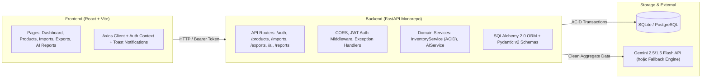

# PHÂN TÍCH YÊU CẦU & KẾ HOẠCH TRIỂN KHAI CHI TIẾT

## Đề tài 07: Hệ thống quản lý kho có tích hợp AI

---

## PHẦN 1: TRÍCH XUẤT YÊU CẦU TƯỜNG MINH (EXPLICIT REQUIREMENTS)

Dựa trên tài liệu đề bài `de_tai_07.md`, các yêu cầu được nêu rõ bao gồm:

### 1.1. Chức năng Quản lý kho (8 tính năng)

1. **Đăng nhập & Phân quyền**: Hỗ trợ tối thiểu 3 nhóm người dùng: Quản trị viên (Admin), Thủ kho (Warehouse Keeper), Kế toán (Accountant).
2. **Quản lý Hàng hóa & Danh mục**: Quản lý thông tin hàng hóa, nhóm hàng (categories), đơn vị tính (unit), ngưỡng tồn tối thiểu (min_stock).
3. **Quản lý Nhà cung cấp**: Quản lý danh sách nhà cung cấp (thông tin liên hệ, mã NCC).
4. **Lập Phiếu nhập kho**: Lập phiếu nhập từ nhà cung cấp và tự động cập nhật tăng tồn kho.
5. **Lập Phiếu xuất kho**: Lập phiếu xuất kho và kiểm tra số lượng hàng còn trong kho.
6. **Tra cứu lịch sử nhập xuất**: Tìm kiếm, lọc theo mã hàng hóa, khoảng thời gian, nhà cung cấp.
7. **Cảnh báo hàng dưới mức tồn tối thiểu**: Phát hiện các mặt hàng có số lượng tồn kho $\le$ tồn tối thiểu.
8. **Thống kê Nhập - Xuất - Tồn & Xuất báo cáo**: Báo cáo tổng hợp số lượng tồn đầu, nhập trong kỳ, xuất trong kỳ, tồn cuối.

### 1.2. Chức năng AI (3 tính năng)

1. **AI sinh báo cáo Nhập - Xuất - Tồn theo tháng**: Dựa trên dữ liệu tổng hợp kho thực tế để sinh nhận xét, phân tích xu hướng.
2. **AI gợi ý nhập hàng**: Dựa trên tồn kho hiện tại, mức tồn tối thiểu và tốc độ xuất (velocity).
3. **AI tóm tắt biến động bất thường**: Nhận diện xuất hàng tăng đột biến hoặc hàng tồn kho lâu ngày không phát sinh xuất kho.

### 1.3. Yêu cầu Kỹ thuật & Phi chức năng

- **Công nghệ**:
  - Backend: FastAPI / Flask / Django (ưu tiên FastAPI).
  - Frontend: React / Vue / HTML template (ưu tiên React + Tailwind CSS).
  - CSDL: SQLite / MySQL / PostgreSQL (SQLite cho môi trường demo, linh hoạt đổi PostgreSQL).
  - AI Engine: OpenAI / Gemini / Claude / Ollama / Hugging Face.
- **Ràng buộc nghiệp vụ & Kỹ thuật**:
  - Phải có **Giao dịch CSDL (Database Transaction)** để đảm bảo cập nhật tồn kho đúng, không bị sai lệch số liệu khi có lỗi hoặc nhiều thao tác đồng thời.
  - Có **Prompt template** chuẩn cho báo cáo kho và gợi ý nhập hàng (ép buộc AI không bịa số liệu - Anti-hallucination).
  - **Bảo mật dữ liệu**: Không gửi thông tin giá mua nhạy cảm vào prompt AI nếu báo cáo không yêu cầu phân tích chi phí.
  - Có **Kiểm thử (Test cases)** cho: Nhập hàng, Xuất hàng, Chặn tồn kho âm, và Báo cáo AI.

### 1.4. Ràng buộc theo giai đoạn SDLC (Tiêu chí chấm điểm)

- **Giai đoạn 1 (Bài KT1)**: Phân tích quy trình, thiết kế ERD, ràng buộc tránh tồn kho âm, xác định Actor, đề xuất tính năng AI, wireframe màn hình.
- **Giai đoạn 2 (Bài KT2)**: Sinh Model/API, logic transaction cập nhật tồn kho, xử lý lỗi tồn kho âm, lưu minh chứng dùng AI trong SDLC.
- **Giai đoạn 3 (Bài KT3)**: Prompt engineering, pipeline tổng hợp dữ liệu trước khi gửi AI, test cases (dữ liệu rỗng, tồn kho âm, xuất tăng đột biến), so sánh hiệu quả prompt.
- **Giai đoạn 4 (Cuối kỳ)**: Hoàn thiện UI/UX, README, seed data mẫu, demo script, tài liệu kỹ thuật và slide báo cáo.

---

## PHẦN 2: SUY LUẬN YÊU CẦU NGẦM ĐỊNH (IMPLICIT REQUIREMENTS)

Để các tính năng trên hoạt động **chính xác, an toàn và đúng chuẩn công nghiệp**, cần suy luận các yêu cầu kỹ thuật ngầm định sau:

| Yêu cầu tường minh | Câu hỏi: "Để làm đúng cách thì cần thêm gì?" | Yêu cầu ngầm định cần bổ sung |
| :--- | :--- | :--- |
| **1. Lập phiếu xuất kho & kiểm tra tồn kho** | Làm sao để chắc chắn không bao giờ bị tồn kho âm kể cả khi 2 thủ kho cùng xuất 1 mặt hàng cùng 1 giây? | - **Row-level locking / Atomic Update**: Kiểm tra tồn kho và trừ tồn trong cùng 1 transaction có điều kiện (`WHERE current_stock >= requested_qty`). - **DB Constraint**: Thêm `CHECK (current_stock >= 0)` trực tiếp ở tầng CSDL để bảo vệ tầng cuối cùng. |
| **2. Cập nhật tồn kho qua phiếu nhập/xuất** | Sau khi phiếu đã hoàn thành, người dùng có được sửa số lượng hoặc xóa phiếu không? Nếu xóa thì tồn kho xử lý sao? | - **Trạng thái phiếu (State Machine)**: Phiếu có trạng thái `DRAFT` (sửa được, chưa đổi tồn kho), `COMPLETED` (đã ghi sổ, cập nhật tồn kho, **không cho sửa/xóa trực tiếp**). - Nếu muốn sửa phiếu đã ghi sổ: Phải tạo phiếu điều chỉnh (Adjustment) hoặc phiếu Hủy (`CANCELLED`) kèm giao dịch đảo ngược số lượng. |
| **3. Phân quyền: Quản trị viên, Thủ kho, Kế toán** | Ai được làm gì? API bảo vệ quyền ra sao? | - **RBAC Matrix (Role-Based Access Control)**:   + *Admin*: Toàn quyền quản lý user, cấu hình hệ thống, danh mục.   + *Thủ kho*: Tạo/duyệt phiếu nhập, phiếu xuất, xem tồn kho, xem cảnh báo.   + *Kế toán*: Xem báo cáo tài chính, giá vốn, giá bán, lịch sử xuất nhập, xuất file Excel/PDF (không trực tiếp sửa tồn kho vật lý). |
| **4. Tra cứu lịch sử nhập xuất & Thẻ kho** | Làm sao truy vết được mặt hàng X tại thời điểm ngày Y có bao nhiêu cái, ai đã xuất, theo phiếu nào? | - **Bảng Sổ kho / Thẻ kho (`stock_ledger`)**: Mỗi lần tăng/giảm tồn kho, lưu 1 bản ghi bất biến (audit trail): `product_id`, `reference_type` (PN/PX), `reference_code`, `qty_change`, `balance_after`, `created_by`, `timestamp`. |
| **5. AI sinh báo cáo & gợi ý nhập hàng** | Dữ liệu kho có hàng nghìn dòng, gửi thẳng vào AI có bị vượt token limit, tốn tiền hoặc AI tính toán sai không? | - **Data Pre-processing / Aggregation Pipeline**: Backend phải truy vấn SQL tổng hợp sẵn số liệu (tổng nhập, tổng xuất, tồn cuối, tốc độ xuất TB/ngày, số ngày tồn đọng) trước khi nhúng vào prompt. - **AI Fallback (Rule-Based Engine)**: Nếu mất mạng hoặc API Key hết hạn/lỗi, hệ thống tự động sinh báo cáo heuristic tương đương, không làm crash app. |
| **6. Cảnh báo hàng dưới tồn tối thiểu** | Cảnh báo hiển thị ở đâu và khi nào? | - Tự động tính toán trạng thái `is_low_stock` khi truy vấn. - Hiển thị Badge cảnh báo màu đỏ/vàng trên Dashboard và danh sách hàng hóa. |
| **7. Validation dữ liệu đầu vào** | Người dùng nhập số lượng âm, chữ vào ô giá tiền, hoặc mã hàng trùng nhau thì sao? | - Sử dụng **Pydantic Schemas** ở Backend để validate: `quantity > 0`, `price >= 0`, chuỗi không rỗng. - Mã hàng, mã phiếu, mã NCC có ràng buộc `UNIQUE` và format tự động (`PN-YYYYMMDD-XXXX`). |
| **8. Kiểm thử nhập, xuất, tồn kho âm, AI** | Làm sao chạy test tự động nhanh và độc lập mà không làm bẩn dữ liệu thật? | - Cấu hình **Pytest fixture** dùng SQLite In-Memory CSDL riêng biệt cho test runner. - Mock AI Service trong unit test để test nhanh và không phụ thuộc internet. |

---

## PHẦN 3: ĐỀ XUẤT PHẦN NỀN TẢNG (FOUNDATION ARCHITECTURE)

Các thành phần kiến trúc nền tảng không được đề bài nhắc tới nhưng bắt buộc phải có để dự án chuyên nghiệp, chạy ổn định và dễ bảo trì:

1. **Cấu trúc thư mục Monorepo chuẩn mực**:
   - `backend/`: Chứa toàn bộ mã nguồn FastAPI, tổ chức theo mô hình Layered Architecture (Routers -> Services -> Repositories/Models -> Schemas).
   - `frontend/`: Chứa mã nguồn React + Vite, tách biệt components, pages, services API, hooks.
   - `docs/SDLC/`: Chứa toàn bộ tài liệu cho 4 giai đoạn đánh giá (KT1, KT2, KT3, Cuối kỳ).
2. **Quy ước đặt tên (Naming Conventions)**:
   - Backend Python: `snake_case` cho hàm/biến, `PascalCase` cho Class/Model, `UPPER_CASE` cho hằng số.
   - Database: Bảng và cột dùng `snake_case` số nhiều (`products`, `import_notes`, `stock_ledger`).
   - Frontend React: `camelCase` cho biến/hàm, `PascalCase` cho Component.
   - REST API: Resource-oriented `/api/v1/products`, `/api/v1/import-notes`, `/api/v1/ai/restock-suggestions`.
3. **Cơ chế Cấu hình & Biến môi trường (`.env`)**:
   - Sử dụng `pydantic-settings` đọc file `.env` (Secret key, CSDL URL, AI API Key, CORS origins).
   - Có file `.env.example` mẫu để người khác clone repo về có thể chạy ngay.
4. **Bảo mật cơ bản (Security Essentials)**:
   - Hash mật khẩu bằng `bcrypt` hoặc `argon2`.
   - Xác thực qua `JWT (JSON Web Tokens)` với thời hạn hết hạn (Access Token).
   - Middleware CORS cấu hình an toàn cho phép kết nối từ frontend.
5. **Cơ chế Seed Data & Khởi tạo CSDL 1-Click**:
   - Script `seed_data.py` tự động tạo tài khoản mẫu (Admin, Thủ kho, Kế toán), 20+ mặt hàng mẫu đủ các trạng thái (bình thường, sắp hết hàng, hàng tồn lâu), nhà cung cấp, và lịch sử nhập/xuất trong 60 ngày để AI có dữ liệu phân tích ngay lập tức khi demo.

---

## PHẦN 4: BẢNG PHÂN ĐỊNH RANH GIỚI (BOUNDARY MATRIX)

Bảng phân loại rõ ràng giữa **Yêu cầu bắt buộc từ đề bài** và **Đề xuất thêm để đảm bảo chất lượng**:

| Thành phần / Chức năng | Phân loại | Căn cứ / Lý do |
| :--- | :---: | :--- |
| **Đăng nhập & Phân quyền (Admin, Thủ kho, Kế toán)** | **[BẮT BUỘC]** | Nêu rõ trong mục 3.1 & 6 (KT1) |
| **Quản lý Hàng hóa, Nhóm hàng, Đơn vị tính, Tồn tối thiểu** | **[BẮT BUỘC]** | Nêu rõ trong mục 3.1 |
| **Quản lý Nhà cung cấp** | **[BẮT BUỘC]** | Nêu rõ trong mục 3.1 |
| **Lập phiếu nhập kho & Cập nhật tồn kho** | **[BẮT BUỘC]** | Nêu rõ trong mục 3.1 |
| **Lập phiếu xuất kho & Kiểm tra tồn kho** | **[BẮT BUỘC]** | Nêu rõ trong mục 3.1 |
| **Database Transaction chống sai lệch & tồn kho âm** | **[BẮT BUỘC]** | Nêu rõ trong mục 4 & 6 (KT2) |
| **Tra cứu lịch sử nhập xuất & Thẻ kho** | **[BẮT BUỘC]** | Nêu rõ trong mục 3.1 & 5 |
| **Cảnh báo hàng dưới mức tồn tối thiểu** | **[BẮT BUỘC]** | Nêu rõ trong mục 3.1 |
| **Báo cáo Nhập - Xuất - Tồn theo kỳ** | **[BẮT BUỘC]** | Nêu rõ trong mục 3.1 |
| **AI sinh báo cáo Nhập - Xuất - Tồn tháng** | **[BẮT BUỘC]** | Nêu rõ trong mục 3.2 |
| **AI gợi ý nhập hàng theo vận tốc xuất** | **[BẮT BUỘC]** | Nêu rõ trong mục 3.2 |
| **AI tóm tắt biến động bất thường & hàng tồn lâu** | **[BẮT BUỘC]** | Nêu rõ trong mục 3.2 |
| **Prompt Template chuẩn & Bảo mật giá mua nhạy cảm** | **[BẮT BUỘC]** | Nêu rõ trong mục 4 & 5 |
| **Test cases: Nhập, Xuất, Tồn kho âm, AI báo cáo** | **[BẮT BUỘC]** | Nêu rõ trong mục 4 & 6 (KT3) |
| **Tài liệu SDLC theo 4 giai đoạn (KT1, KT2, KT3, Cuối kỳ)** | **[BẮT BUỘC]** | Nêu rõ trong mục 6 |
| *Bảng Thẻ kho bất biến (`stock_ledger` audit trail)* | *[ĐỀ XUẤT THÊM]* | Cần thiết để truy vết chính xác lịch sử thay đổi tồn kho từng giây |
| *State Machine cho phiếu (`DRAFT` / `COMPLETED` / `CANCELLED`)* | *[ĐỀ XUẤT THÊM]* | Ngăn chặn sửa/xóa tùy tiện làm vỡ tính nhất quán số lượng tồn kho |
| *Heuristic Rule-Based Fallback Engine cho AI* | *[ĐỀ XUẤT THÊM]* | Đảm bảo demo luôn chạy mượt mà ngay cả khi không có mạng/hết API Key |
| *Database Check Constraint `CHECK (current_stock >= 0)`* | *[ĐỀ XUẤT THÊM]* | Chốt chặn an toàn cấp CSDL chống mọi lỗi logic ở tầng ứng dụng |
| *Bộ Seed Data thực tế (hàng hóa, nhà cung cấp, giao dịch 60 ngày)* | *[ĐỀ XUẤT THÊM]* | Giúp chạy demo ngay lập tức, AI có đủ dữ liệu lịch sử để phân tích |
| *Giao diện Web Dashboard trực quan với biểu đồ (Recharts/Chart.js)* | *[ĐỀ XUẤT THÊM]* | Nâng cao trải nghiệm người dùng và tính thẩm mỹ khi chấm đồ án |

---

## PHẦN 5: KẾ HOẠCH TRIỂN KHAI CHI TIẾT (PRIORITIZED IMPLEMENTATION PLAN)

Kế hoạch được chia thành 4 giai đoạn tương ứng với quy trình SDLC của đề tài, mỗi tác vụ được gắn nhãn ưu tiên:

- 🔴 **P0 (Phải làm - Must Have)**: Bắt buộc từ đề bài, điều kiện cần để vượt qua các bài kiểm tra.
- 🟡 **P1 (Nên làm - Should Have)**: Đề xuất thêm để hệ thống đạt chất lượng cao, chạy ổn định, điểm tối đa.
- 🟢 **P2 (Có thể làm sau - Nice to Have)**: Nâng cao trải nghiệm nếu còn thời gian.

---

### GIAI ĐOẠN 1: PHÂN TÍCH YÊU CẦU & THIẾT KẾ HỆ THỐNG (BÀI KT1)

- [ ] **Bước 1.1 [P0]**: Soạn thảo tài liệu Đặc tả yêu cầu & Actor/Use Case (`docs/SDLC/01_SRS_and_UseCases.md`).
  - Xác định chi tiết 3 Actor: Quản trị viên, Thủ kho, Kế toán.
  - Vẽ sơ đồ Use Case tổng quan và mô tả chi tiết luồng nghiệp vụ Nhập - Xuất - Kiểm kho.
- [ ] **Bước 1.2 [P0]**: Thiết kế CSDL & Mô hình quan hệ ERD (`docs/SDLC/02_Database_Design_ERD.md`).
  - Thiết kế chi tiết các bảng: `users`, `categories`, `products`, `suppliers`, `import_notes`, `import_note_details`, `export_notes`, `export_note_details`.
  - [P1] Bổ sung bảng `stock_ledger` (Thẻ kho) và ràng buộc `CHECK (current_stock >= 0)`.
- [ ] **Bước 1.3 [P0]**: Thiết kế Kiến trúc AI & Prompt Strategy (`docs/SDLC/03_AI_Architecture_and_Prompts.md`).
  - Thiết kế luồng tổng hợp dữ liệu, prompt mẫu chống ảo giác, lọc giá mua nhạy cảm.
- [ ] **Bước 1.4 [P0]**: Phác thảo Wireframe & User Flow (`docs/SDLC/04_Wireframes.md`).
  - Wireframe cho Dashboard, Màn hình Phiếu nhập/xuất, Báo cáo AI.

---

### GIAI ĐOẠN 2: XÂY DỰNG CHỨC NĂNG QUẢN LÝ KHO & TRANSACTION (BÀI KT2)

- [ ] **Bước 2.1 [P0]**: Khởi tạo cấu trúc dự án Backend & Frontend.
  - Backend: FastAPI, SQLAlchemy 2.0, Pydantic v2, SQLite, Pytest.
  - Frontend: React + Vite + Tailwind CSS + Lucide Icons.
  - Cấu hình `.env` và `settings.py`.
- [ ] **Bước 2.2 [P0]**: Cài đặt Authentication & Phân quyền RBAC.
  - Model `User`, hash mật khẩu bằng `bcrypt`, cấp JWT token.
  - Dependency inject kiểm tra quyền: `get_current_user`, `require_role(["ADMIN", "WAREHOUSE_KEEPER"])`.
- [ ] **Bước 2.3 [P0]**: Xây dựng APIs Danh mục & Hàng hóa & Nhà cung cấp.
  - CRUD Nhóm hàng, Đơn vị tính.
  - CRUD Hàng hóa kèm trường `min_stock`, `current_stock`.
  - CRUD Nhà cung cấp.
- [ ] **Bước 2.4 [P0]**: Xây dựng Logic Nhập kho với Database Transaction.
  - API tạo phiếu nhập `POST /api/v1/import-notes`.
  - Atomic Transaction: Lưu phiếu + Lưu chi tiết + Tăng `current_stock` + [P1] Ghi thẻ kho `stock_ledger`.
- [ ] **Bước 2.5 [P0]**: Xây dựng Logic Xuất kho với Kiểm tra tồn & Chống tồn kho âm.
  - API tạo phiếu xuất `POST /api/v1/export-notes`.
  - Atomic Transaction: Kiểm tra số lượng còn -> Nếu thiếu thì **Rollback & Báo lỗi 400** -> Nếu đủ thì Giảm `current_stock` + [P1] Ghi thẻ kho.
- [ ] **Bước 2.6 [P0]**: Xây dựng API Tra cứu lịch sử & Báo cáo Nhập-Xuất-Tồn.
  - Lọc theo khoảng ngày, hàng hóa, nhà cung cấp.
  - Tính toán tồn đầu kỳ, nhập, xuất, tồn cuối kỳ.
  - API danh sách cảnh báo hàng sắp hết (`current_stock <= min_stock`).
- [ ] **Bước 2.7 [P1]**: Xây dựng script `seed_data.py` nạp sẵn 20+ sản phẩm, 3 user mẫu, giao dịch thực tế 60 ngày.

---

### GIAI ĐOẠN 3: TÍCH HỢP AI, PROMPT OPTIMIZATION & KIỂM THỬ (BÀI KT3)

- [ ] **Bước 3.1 [P0]**: Xây dựng Data Aggregator Pipeline cho AI (`backend/app/services/ai_service.py`).
  - Hàm truy vấn trích xuất: Bảng tồn kho, tốc độ xuất 30 ngày qua, hàng dưới tồn tối thiểu, hàng không xuất > 30 ngày, mặt hàng xuất tăng vọt > 200%.
  - Lọc bỏ thông tin giá mua nhạy cảm.
- [ ] **Bước 3.2 [P0]**: Triển khai Prompt Templates & Kết nối AI Engine.
  - Kết nối Google Gemini API (hoặc OpenAI).
  - Triển khai 3 tính năng AI cụ thể:
    1. Báo cáo Nhập-Xuất-Tồn tháng kèm phân tích chuyên sâu.
    2. Gợi ý nhập hàng (số lượng đề xuất, lý do, mức độ ưu tiên).
    3. Cảnh báo bất thường (xuất đột biến, hàng ứ đọng).
- [ ] **Bước 3.3 [P1]**: Triển khai Heuristic Fallback Engine.
  - Tự động sinh báo cáo và gợi ý thông minh dạng thuật toán nếu không có API Key hoặc mất mạng.
- [ ] **Bước 3.4 [P0]**: Viết Bộ Kiểm thử Tự động (Pytest).
  - `test_import_stock`: Kiểm tra nhập kho cập nhật đúng tồn kho.
  - `test_prevent_negative_stock`: Kiểm tra chặn xuất vượt tồn kho, trả về lỗi 400 và không làm sai số liệu.
  - `test_concurrency_stock`: Kiểm tra tính nhất quán khi có nhiều yêu cầu đồng thời.
  - `test_ai_service_prompt`: Kiểm tra pipeline tổng hợp dữ liệu và sinh báo cáo khi dữ liệu rỗng và khi có biến động.
- [ ] **Bước 3.5 [P0]**: Báo cáo so sánh chất lượng Prompt & Minh chứng SDLC (`docs/SDLC/05_AI_Usage_and_Prompt_Evaluation.md`).

---

### GIAI ĐOẠN 4: HOÀN THIỆN GIAI DIỆN, ĐÓNG GÓI & BÁO CÁO (BÀI THI CUỐI KỲ)

- [ ] **Bước 4.1 [P0]**: Hoàn thiện Giao diện Web (React + Tailwind CSS).
  - Màn hình Đăng nhập & Đổi vai trò tiện lợi khi demo.
  - Dashboard tổng quan: KPIs (Tổng hàng, cảnh báo hết hàng, giá trị tồn kho), biểu đồ trực quan [P1].
  - Màn hình Quản lý Hàng hóa & Nhà cung cấp (Tìm kiếm, lọc, thêm/sửa/xóa).
  - Màn hình Lập phiếu Nhập & Phiếu Xuất (Form chọn hàng nhanh, tự động tính tổng tiền, cảnh báo tồn kho tức thời).
  - Màn hình Báo cáo Nhập-Xuất-Tồn & Tra cứu Thẻ kho.
  - Màn hình Trợ lý AI (Nút bấm sinh báo cáo 1-click, xem gợi ý nhập hàng, xem cảnh báo bất thường).
- [ ] **Bước 4.2 [P0]**: Soạn thảo tài liệu `README.md` & Hướng dẫn cài đặt 1-Click.
  - Hướng dẫn cài đặt môi trường, chạy backend, chạy frontend, chạy test suite.
  - Hướng dẫn tài khoản demo và kịch bản demo cho giảng viên.
- [ ] **Bước 4.3 [P1]**: Tài liệu kỹ thuật tổng kết đồ án & Slide thuyết trình (`docs/SDLC/06_Final_Report.md`).
